## Introduction

This Tutorial will take you through the basics of creating a theme for EmulationStation (ES) and RetroPie.

It will create a simple theme called Spare. The default Carbon theme as a reference, while creating all the XML from scratch, so you will get a better understanding of it.

During the course, three systems will be covered as example:

- Game Boy (folder: `gb`)
- Nintendo Entertainment System (folder: `nes`)
- Super Nintendo Entertainment System (folder: `snes`)

These systems are not only ubiquitous but contain some graphically layout challenges, for example the different shaped box art (square, portrait and landscape respectively), and we will be using those differences for some more advanced concepts in a later tutorial.

After the exercise with three theme-layouts for these systems you should have got an understanding how theming works in general. Three is the minimum of systems to fill the carousel and also the maximum visible at the same time.

The theme you are going to make will look like this:

<figure markdown>
  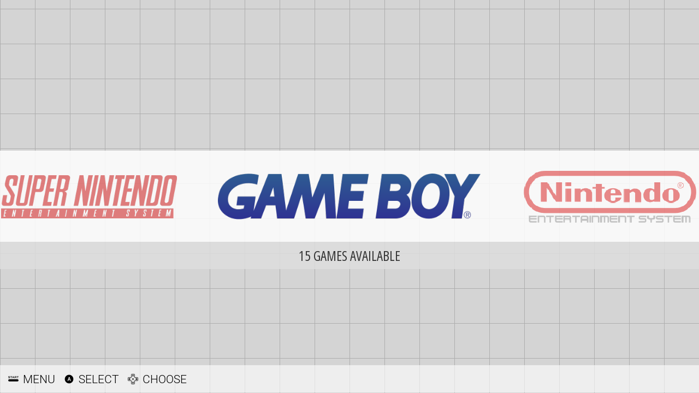
  <figcaption>Spare Theme System View</figcaption>
</figure>

<figure markdown>
  
  <figcaption>Spare Theme Basic View</figcaption>
</figure>

<figure markdown>
  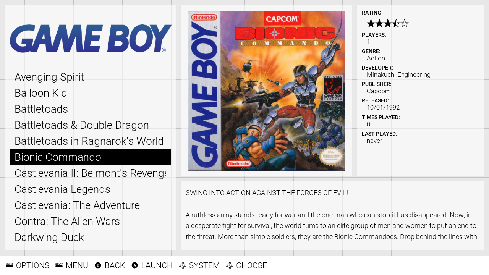
  <figcaption>Spare Theme Detailed View</figcaption>
</figure>

It is a simple, clean theme, not very outlandish, but it's enough to teach the essentials, and a few of the more advanced ideas.

**Note**

> This tutorial was developed on Windows, but all the main parts (the XML and images) can be done on any Operating System, as long as you can access and modify files in the `theme` folder on your Raspberry Pi (e.g., with Samba, see [setup](#use-samba-share-of-emulationstations-themes-on-retropie)).

### What You Will Need

- A text editor
    - Notepad will do fine, but something with syntax highlighting is way more helpful. Whatever editor you prefer: It should support XML formatting and maybe even XML linting.
- EmulationStation
    - This tutorial uses a version on a Windows machine (more on that below), but the version on your Pi is fine.
- An image editor
    - This is optional as all the images will be supplied, however you can use these images as a base to create your own, or make your own from scratch. On Windows you may use Photoshop, but other programs like GIMP, Inkscape, Krita or Paint.net would work too. Whenever possible use SVG format for your graphics instead of pixel based formats (JPG/PNG) as the former scales properly without visible artifacts.
- The ES Theme Helper by @Rookervik
    - Not essential, but very, very handy
    -  [Get it from @Rookervik's DropBox here](https://dl.dropboxusercontent.com/u/60872572/EmulationStation/ES%20Theme%20Helper3.rar)
- Any coding experience
    - Again, not essential, but it makes things easier. To be honest, as long as you know that `<tag>` opens a tag (more precisely an XML element) and `</tag>` closes a tag, then you should be fine.

The (sample) files you will need for this tutorial are listed [here](#references).

### Primer on EmulationStation Views

EmulationStation has three main navigation sections, called _Views_:

<figure markdown>
  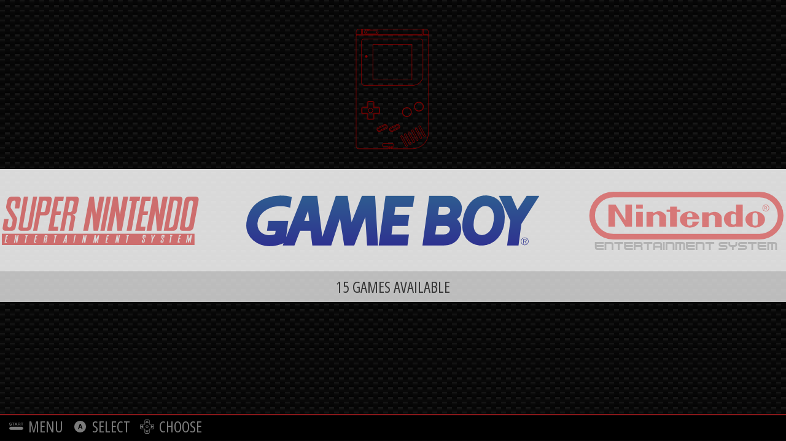
  <figcaption>Carbon Theme System View</figcaption>
</figure>
The _System View_ is what you see when EmulationStation starts. It has a large white bar along the middle that houses a carousel that shows three System logos at a time.

<figure markdown>
  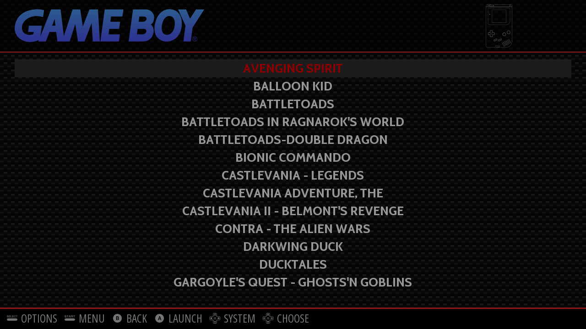
  <figcaption>Carbon Theme Basic View</figcaption>
</figure>
This is a simple game list page. You see this if you haven't scraped any metadata for that system.

<figure markdown>
  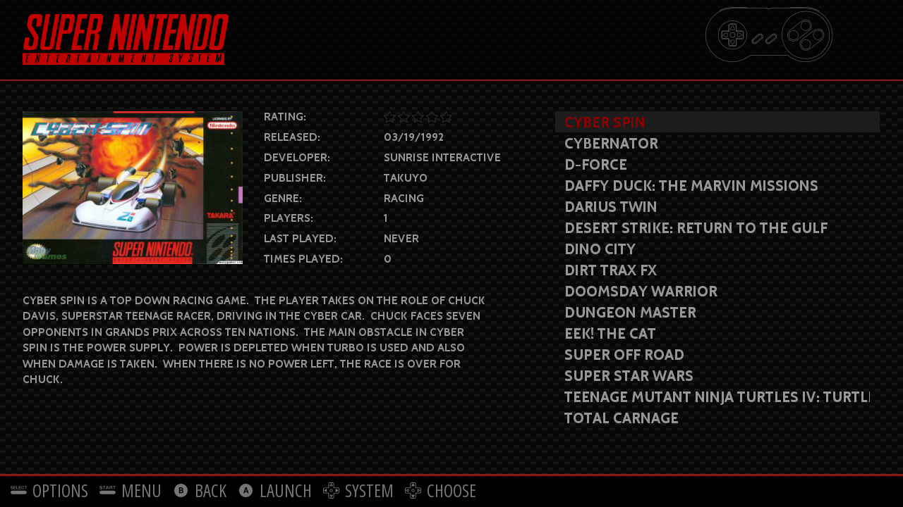
  <figcaption>Carbon Theme Detailed View</figcaption>
</figure>
The _Detailed View_ is what you see if you *have* scraped metadata. Different themes can show different data, in different places or a different order, but every theme can only display these values (along with the Game List):

- `md_description`
- `md_developer`
- `md_genre`
- `md_image`
- `md_thumbnail`
- `md_lastplayed`: Stored as ISO8601 date time format e.g., 2023-03-17T19:14:12+00:00
- `md_playcount`
- `md_players`
- `md_publisher`
- `md_rating`
- `md_marquee`
- `md_releasedate`: Stored as ISO8601 date format e.g., 2023-03-17

Finally, the _Video View_ is what you see if your scraped metadata includes videos. The video view is an extension of the Detailed View. It can display all the values found in the Detailed View along with a _video_ metadata tag:

- `md_video`

Extra values can be added by the Theme Maker, but the ones above are the only ones that get scraped by EmulationStation. Any others have to have their data entered by hand. More on the `extra` attribute later, in the [System View Section](#system-view).

## Setup

This tutorial uses the portable version of EmulationStation created by @herb_fargus. But this is not a restriction, you can use your own ES setup on a different system and may use for example Samba to serve the theme files.

### Set Up EmulationStation on PC

<iframe width="560" height="315" src="https://www.youtube-nocookie.com/embed/oHtCnBiyzOY" title="EmulationStation Windows Portable (USB Stick)" frameborder="0" allow="accelerometer; autoplay; clipboard-write; encrypted-media; gyroscope; picture-in-picture; allowfullscreen"></iframe>

- Download the portable EmulationStation by @herb_fargus, see [references](#references)
- Install/unzip it where you want it. For example if you have it on `F:\` drive, so the path is `F:\emulationstation`
- Download the fake games' collection, see [references](#references). Within it are three folders: `gb`, `nes` and `snes`. Within each folder are 15 empty files, each named after a game on that system. These files have also had their extensions changed to something that EmulationStation will recognize as a ROM.
  - _These are not real ROMs. They are blank text files that have been renamed to look like ROMs._
  - EmulationStation sees these as real games. You won't be able to play them (since they are really just empty files), but they will scrape with the built-in EmulationStation scraper. They are also tiny, so you don't have to worry about your test-bed getting too big.
- Copy those folders into `F:\emulationstation\\.emulationstation\roms`


EmulationStation should now be set up with 45 (fake) games on three Systems, and ready for you to use.

Double click `Launch Portable (Windowed).bat` to start EmulationStation.

### Use Samba Share of EmulationStation's Themes on RetroPie

You may also edit theme files directly on the Raspberry. However, you should use a wired network connection between your desktop and the Raspberry to enable smooth editing. Open `\\retropie\configs\all\emulationstation\themes\` in the Windows File Explorer. You should be able to see (and edit) the currently installed themes of your EmulationStation installation. If you do not see any theme, then install the Spare theme as outlined below. For reloading a theme (see [shortcuts](#keyboard-shortcuts-in-emulationstation)) you should also have a keyboard attached to your RetroPie, and it should be in reach from your desktop system.

## Creating a Theme

We're going to make the theme straight in the Portable EmulationStation's theme folder. Of course, you are free to act directly on the Samba Share, which does not require file copy operations.

If you use the portable EmulationStation on `F:\` drive, so the path to the `themes` folder would be `F:\emulationstation\\.emulationstation\themes`.

First, [download the full Spare theme from GitHub](https://github.com/mattrixk/es-theme-spare), so you have the images and fonts you need, and also, so you have something to reference.

We'll start by setting up a simple file structure, with folders for the three console systems; Game Boy (`gb`), Nintendo Entertainment System (`nes`) and Super Nintendo Entertainment System (`snes`).

- Within the themes folder make a folder called `spare`.
- In the `spare` folder make a new file called `spare.xml`.

- Within the `spare` folder make folders called `nes`, `snes`, `gb` and `_inc`.
- In each of `nes`, `snes`, `gb` make a new file called `theme.xml`.
- Also copy the system images from the downloaded file into the system folders

- `_inc` is your includes folder where you will hold your fonts and theme images. You can call it anything you like. Some other themes use `art`, others use `common`. This tutorial uses `_inc` with an underscore which keeps it at the top of the file tree.
- Within `_inc` create two folders, called `fonts` and `images`. Copy the fonts and images from the downloaded file into their respective folders.

Your folder structure should now look like this:

<figure markdown>
  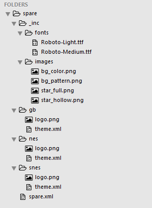
  <figcaption>Folder Structure</figcaption>
</figure>

Now onto the code.

Open `spare.xml` and add these lines:
```xml
<!--
theme name:     Spare
version:        1.0
author:         Matt Kennedy
email:
website:
license:        creative commons CC-BY-NC-SA
based on:       "Carbon" by Eric Hettervik
-->

<theme>

    <formatVersion>4</formatVersion>

    <view name="system"></view>
    <view name="basic"></view>
    <view name="detailed"></view>
    <view name="video"></view>

</theme>
```
When you are making your own theme you would obviously change the 'theme name' and 'author' fields to suit.

- The theme details at the top just tell anyone looking who made the theme.
- Anything within `<!-- x -->` is a comment, visible to humans who read the code, but invisible to EmulationStation.
- The `<theme></theme>` fields tell EmulationStation that the code within is for a theme.
- The `<formatVersion>4</formatVersion>` sets the theme version. The version 3 is the latest by the original author of EmulationStation, within RetroPie's fork of EmulationStation the current Version is 4 which -among other things- support the Child-Friendly setup (aka "kid mode" in UI settings).
- `<view name="x"></view>` governs what happens in each of those views.

Save `spare.xml`

Open `spare/gb/theme.xml` and add these lines:
```xml
<theme>

    <formatVersion>4</formatVersion>
    <include>./../spare.xml</include>

    <view name="system"></view>
    <view name="basic"></view>
    <view name="detailed"></view>
    <view name="video"></view>

</theme>
```
Notice that it's almost identical to `spare.xml`, except for a few things. You don't need to specify any theme details, because we are using this line:

`<include>./../spare.xml</include>`

That line means, find a file up one level from here, called `spare.xml`, and include it in this file.

This is handy because it means you can have the bulk of your code in `spare.xml` and just call the file in each `theme.xml` instead of having to put the code in each individual `theme.xml` file.

Save `theme.xml`

If you switch EmulationStation to the Spare theme now, this is what you should see:

<figure markdown>
  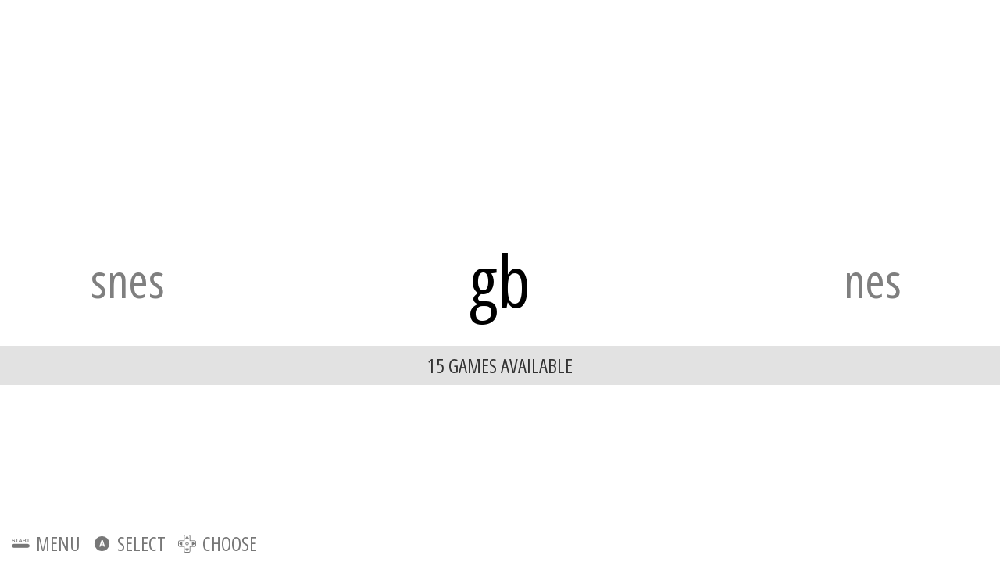
  <figcaption>Blank System View</figcaption>
</figure>

<figure markdown>
  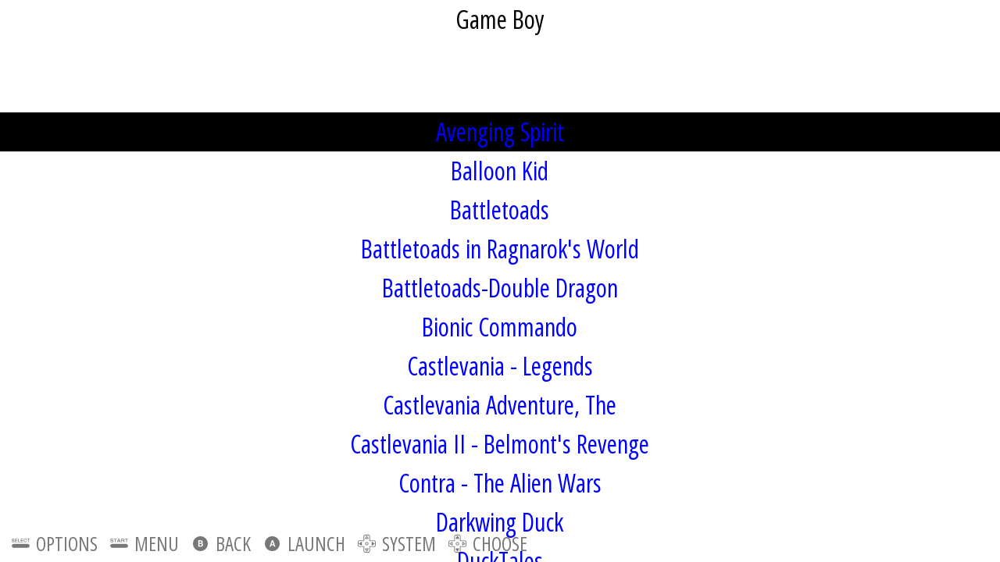
  <figcaption>Blank Basic View</figcaption>
</figure>

<figure markdown>
  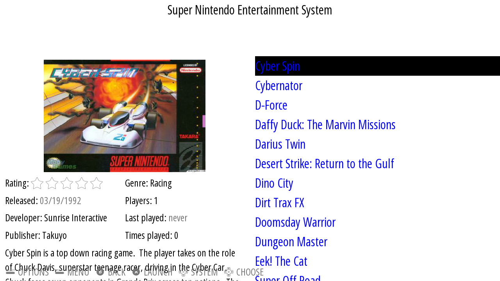
  <figcaption>Blank Detailed View</figcaption>
</figure>

What you are seeing are the EmulationStation defaults. We haven't yet told EmulationStation how we want anything to look, so for now it's just raw data with very, very basic styling. It's our job as "Themers" to change that.

### System View

Now let's create the System View.

<figure markdown>
  
  <figcaption>Spare Theme System View</figcaption>
</figure>

Take note of how it differs from the blank theme.

- There are now Logos in place of simple folder names.
- The white carousel and the gray bar below it hadn't changed (unfortunately, they are hard coded into EmulationStation and for the time being are not theme-able).
- Note the gray background color behind the carousel.
- This System View has now a repeating background image behind the carousel.
- There is a semi-transparent white bar behind the _Help Menu_ text in the footer.
- The _Help Menu_ now has a different color and different font.

Open `spare.xml`

We'll start simple. Let's change the background color.

Expand `<view name="system"></view>` so it looks like this:

```xml
<view name="system">

</view>
```

Now we add some **Elements** to the View. To start with we'll change the background color by creating a new Image Element called `background_color`.

```xml
<view name="system">
    <image name="background_color" extra="true"></image>
</view>
```

**The `extra` attribute**

> The `extra="true"` XML attribute means that this is a new XML **Element** being added, not something that is already defined by EmulationStation

We need to add some **Properties** (as XML child elements) to the Element to tell it what to do. There are seven Properties accepted by the image Element. They are:

- `<pos>`: The position of the image within the screen, given in percentage of the actual display resolution.
- `<size>`:The absolute size of the image given in percentage of the actual display resolution. Does not maintain aspect ratio. Use either this or `<maxSize>`, not both.
- `<maxSize>`: The maximum size to stretch an image. Maintains aspect ratio. Use either this or `<size>`, not both.
- `<origin>`: The origin point of the image. Default is top-left.
- `<path>`: The relative path to the image file.
- `<tile>`: If the image repeats or not.
- `<color>`: A color overlay, allowing you to change the color and opacity of the image. Uses four bytes values. The first three bytes represent the Hex color code (one byte per red, green, blue) with the last byte is defining the opacity (alpha channel).

If you want a more detailed explanation of Element Properties you can read [this section](https://github.com/RetroPie/EmulationStation/blob/master/THEMES.md#image) of the EmulationStation themes documentation. Especially if you want to use absolute pixel sizes (see [`<resolution/>`](https://github.com/RetroPie/EmulationStation/blob/master/THEMES.md#the-resolution-tag) element).

The first thing we'll do is set the path to the image: You should already have `bg_color.png` in your images' folder. If not, grab it from the Spare theme you downloaded earlier and place it in the `spare/_inc/images` folder. This image is a simple, white 32 x 32px PNG.

**Warning**

> Do not omit the heading dot (`.`) in `<path>`.

Add the line:
`<path>./_inc/images/bg_color.png</path>`
to
`<image name="background_color" extra="true"></image>`
so it looks like this:
```xml
<image name="background_color" extra="true">
    <path>./_inc/images/bg_color.png</path>
</image>
```

Here we are telling ES to look for an image called `bg_color.png` within a folder called `images` that sits within a folder called `_inc` that sits at `root` level.

Now we tell the Image where we want it to sit and how big we want it to be. We want it to start at the top left of the screen and stretch all the way to the bottom right. For that we need the `<origin>`, `<pos>` and `<size>` Properties.

- `<origin>0 0</origin>` tells ES that the image originates at X position = 0 (left) and Y position = 0 (top).
- `<pos>0 0</pos>` tells ES to place the `<origin>` of the image in X position = 0 (left) and Y position = 0 (top).
- `<size>1 1</size>` tells ES the stretch the image 100% along the X-axis (horizontal) and 100% along the Y-axis (vertical).

Put it all together and it looks like this:
```xml
<image name="background_color" extra="true">
    <path>./_inc/images/bg_white.png</path>
	<origin>0 0</origin>
	<pos>0 0</pos>
	<size>1 1</size>
</image>
```

**Tip: Reloading the theme changes**

> If you want to see any changes you have made to your theme files, first save the file. Start EmulationStation with the `--debug`. Within EmulationStation press _left_ ++ctrl+r++ whenever you want to force the theme to be re-applied. This will be referred as "refresh the theme" in this tutorial.

If you refresh the ES theme now (see tip on the right) you wouldn't see anything different, because the background was already white.

This is where the `<color>` Property comes into play. You can use this Property to change the white PNG to any color you want using [Hex color codes](https://www.htmlgoodies.com/tutorials/colors/article.php/3478951). There are many online [color picker tools](https://htmlcolorcodes.com/color-picker/) you can use to get your Hex color codes, just remember they need to be six numbers/letters to work correctly.

If we want to change our background color to Red, we add this line to the `background_color` Element:

`<color>FF0000</color>`

Other randomly chosen colors:

**Tip: Transparency**

> If you do not define a value for alpha channel (the fourth byte). Alpha channel will be 255 (hex: `0xff`), which means full opacity.

- `<color>70D6F3</color>` = Light Blue
- `<color>229C29</color>` = Dark Green
- `<color>FF7700</color>` = Orange
- `<color>CF1F97</color>` = Purple

Let's choose a light gray color, so it stands out a little, but not too much. Your `background_color` Element should now look like this:
```xml
<image name="background_color" extra="true">
    <path>./_inc/images/bg_color.png</path>
	<origin>0 0</origin>
	<pos>0 0</pos>
	<size>1 1</size>
	<color>d4d4d4</color>
</image>
```
And if you refresh ES, you'll now see a light gray background behind the Carousel.

It should look like this:

<figure markdown>
  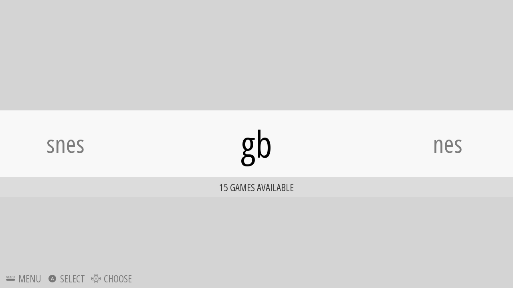
  <figcaption>Spare Theme System View - Background Colour</figcaption>
</figure>

Now for the Background Pattern:

- `bg_pattern.png` should already be in your `spare/_inc/images` folder.
- Duplicate the `background_color` Element and change it, so it looks like this:
```xml
<image name="background_pattern" extra="true">
    <path>./_inc/images/bg_pattern.png</path>
	<origin>0.5 0.5</origin>
	<pos>0.5 0.5</pos>
	<size>1 1</size>
	<color>aeaeae</color>
	<tile>true</tile>
</image>
```
What we've done here is:

- Renamed the Element to `background_pattern`.
- Changed the `<path>` to point to the `bg_pattern.png` image.
- Adapted the `<origin>` to be the center of the image instead of the left-top.
- Adapted the `<pos>` to be the center of the screen instead of the left-top.
- Modified the `<color>` to be a darker gray.
- Added the line `<tile>true</tile>`. This line tells ES to repeat the image over the space instead of stretching it out.

**Note**

> Changing the `<origin>` and `<pos>` isn't strictly necessary, but it looks more interesting with most patterns, so they start from the center of the screen instead of the left-top. As usual, it's up to you what you prefer.

It should look like this:

<figure markdown>
  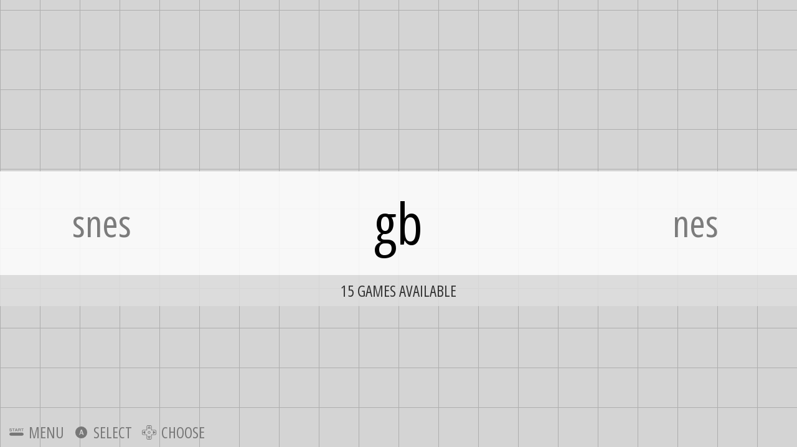
  <figcaption>Spare Theme System View - Background Pattern</figcaption>
</figure>

#### Help Menu Background

This is the background that covers the Help menu items in the bottom left of the screen.

- Again, duplicate the `background_color` Element and change it, so it looks like this:
```xml
<image name="background_help" extra="true">
    <path>./_inc/images/bg_color.png</path>
	<origin>0 1</origin>
	<pos>0 1</pos>
	<size>1 0.070</size>
	<color>FFFFFF99</color>
</image>
```
What we've done here is:

- Renamed the Element to `background_help`.
- Changed the `<path>` to point to the `bg_help.png` image.
- Adapted the `<origin>` to be the left-bottom of the image instead of the left-top.
- Adapted the `<pos>` to be the left-bottom of the screen instead of the left-top.
- Changed the `<size>` from '1 1' to '1 0.070'. What this means is, we still want the image to stretch the full width of the screen, but we only want it to be 7% of the screen height.
- Told the background to be white `FFFFFF`, but we also added `99` to the end of the `<color>` to give it a slight transparency. `FF` is fully opaque and `00` is completely transparent.

It should look like this:

<figure markdown>
  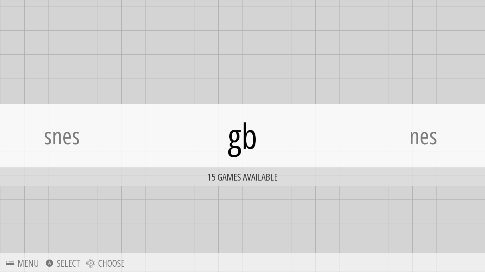
  <figcaption>Spare Theme System View - Help Background</figcaption>
</figure>

#### Help Menu Font

We're going to change the Font used in this theme to Roboto Light (and a little Roboto Bold), and also change the color of the Font.

Add these lines to `spare.xml` under `background_help`:
```xml
<helpsystem name="help">
    <textColor>000000</textColor>
    <iconColor>000000</iconColor>
    <fontPath>./_inc/fonts/Roboto-Light.ttf</fontPath>
    <fontSize>0.03</fontSize>
</helpsystem>
```
This changes:

- Text and icon color to black.
- Font from default to Roboto Light.
- Font size.

It should look like this:

<figure markdown>
  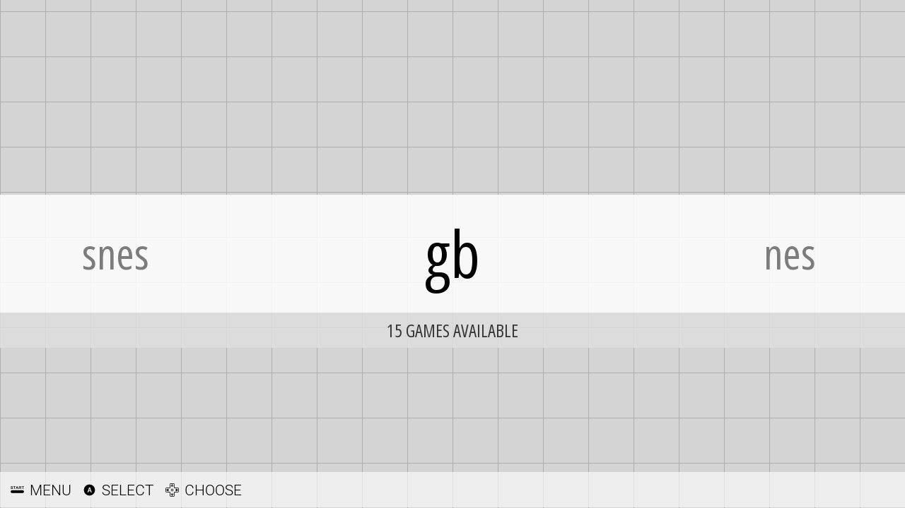
  <figcaption>Spare Theme System View - Help Font</figcaption>
</figure>

Save `spare.xml`

We're nearly done with the _System View_. All that remains is to add the System **Logos** to the Carousel.

Open `spare/gb/theme.xml`

Expand `<view name="system"></view>` and insert the following line:
```xml
<image name="logo">
    <path>./logo.png</path>
</image>
```
So it looks like this:
```xml
<view name="system">
    <image name="logo">
        <path>./system.svg</path>
    </image>
</view>
```
This tells ES to look in the same folder for an image called `system.svg` and to use it as the image for the Carousel in the System View.

Save `theme.xml`

Do this for both the `nes` and `snes` folders as well.

Refresh ES and have a look at the _System View_. It should now look like this:

<figure markdown>
  
  <figcaption>Spare Theme System View</figcaption>
</figure>

### Basic View

The Basic View should look like this:

<figure markdown>
  
  <figcaption>Spare Theme Basic View</figcaption>
</figure>

As you can see, the background color, background pattern and Help menu are the same as the System View. That means we can use the same code for both.

Open `spare.xml`. It should look like this:
```xml
<!--
theme name:     Spare
version:        1.0
author:         Matt Kennedy
email:
website:
license:        creative commons CC-BY-NC-SA
based on:       "Carbon" by Eric Hettervik
-->

<theme>

    <formatVersion>4</formatVersion>

    <view name="system">
		<image name="background_color" extra="true">
			<path>./_inc/images/bg_color.png</path>
			<origin>0 0</origin>
			<pos>0 0</pos>
			<size>1 1</size>
			<color>d4d4d4</color>
		</image>

		<image name="background_pattern" extra="true">
			<path>./_inc/images/bg_pattern.png</path>
			<origin>0.5 0.5</origin>
			<pos>0.5 0.5</pos>
			<size>1 1</size>
			<color>aeaeae</color>
			<tile>true</tile>
		</image>

		<image name="background_help" extra="true">
			<path>./_inc/images/bg_color.png</path>
			<origin>0 1</origin>
			<pos>0 1</pos>
			<size>1 0.070</size>
			<color>FFFFFF99</color>
		</image>

		<helpsystem name="help">
			<textColor>000000</textColor>
			<iconColor>000000</iconColor>
			<fontPath>./_inc/fonts/Roboto-Light.ttf</fontPath>
			<fontSize>0.03</fontSize>
		</helpsystem>
    </view>
    <view name="basic"></view>
    <view name="detailed"></view>
    <view name="video"></view>

</theme>
```
Now, we could just copy all the `<image>` Elements and paste them into `<view name="basic"></view>`, but there is an easier way.

Change:
`<view name="system">`
to
`<view name="system, basic, detailed, video">`

Done. Now, instead of saying that the following code is just for the System View, it's also for the Basic, Detailed and Video Views. How easy was that? This trick will come in handy a lot later on.

Now we just need to style the System Logo and the Gamelist.

**System Logo**

For the **System Logo**, we're going to use the same trick as above. Open `spare/gb/theme.xml` and change:
`<view name="system">`
to
`<view name="system, basic, detailed, video">`

That means anything within that `<view>` will apply to all four views.

The Basic View should now look like this:

<figure markdown>
  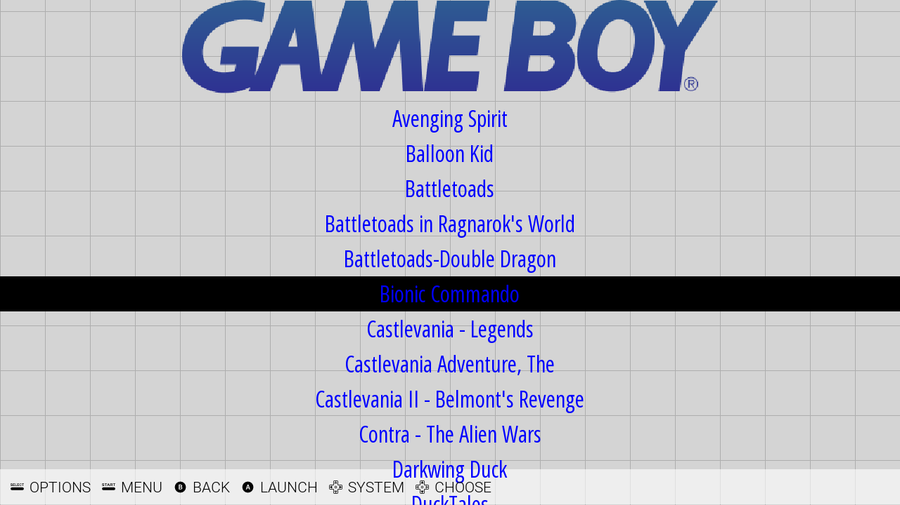
  <figcaption>Spare Theme Basic View - Background</figcaption>
</figure>

Save `theme.xml`.

Back in `spare.xml` we are going to create a semi-transparent white background box in the header to match the one in the footer (behind the Help menu).

Expand `<view name="basic"></view>` and insert the following:
```xml
<image name="background_logo" extra="true">
	<path>./_inc/images/bg_color.png</path>
	<origin>0 0</origin>
	<pos>0 0</pos>
	<size>1 0.18</size>
	<color>FFFFFF99</color>
</image>
```
This places a white box across the top of the screen that is 100% of the screen in width and 18% of the screen in height:

<figure markdown>
  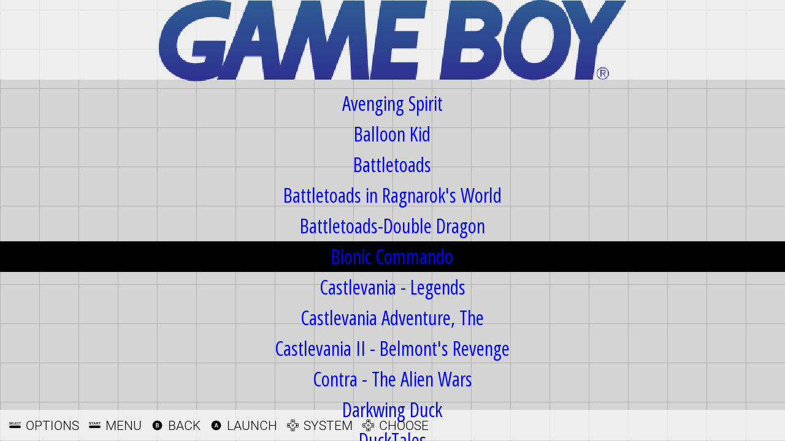
  <figcaption>Spare Theme Basic View - Logo Background</figcaption>
</figure>

The concept of **Helper Boxes**. These are just semi-transparent colored boxes that can be used to work out where an Element will sit on the screen. For example: Use one to place the Logo.

```xml
<image name="logo_helper" extra="true">
	<path>./_inc/images/bg_color.png</path>
	<origin>0.5 0.5</origin>
	<pos>0.5 0.09</pos>
	<size>0.4 0.16</size>
	<color>ff0000aa</color>
</image>
```
- `<origin>0.5 0.5</origin>` sets the Origin Point to the center of the box.
- `<pos>0.5 0.09</pos>` puts the Origin Point of the box at 50% of the screen width, and at 9% of the screen height.
- `<size>0.4 0.16</size>` means the box is 40% wide and 16% high.
- `<color>ff0000aa</color>` gives the box a transparent red color.

Like this:
<figure markdown>
  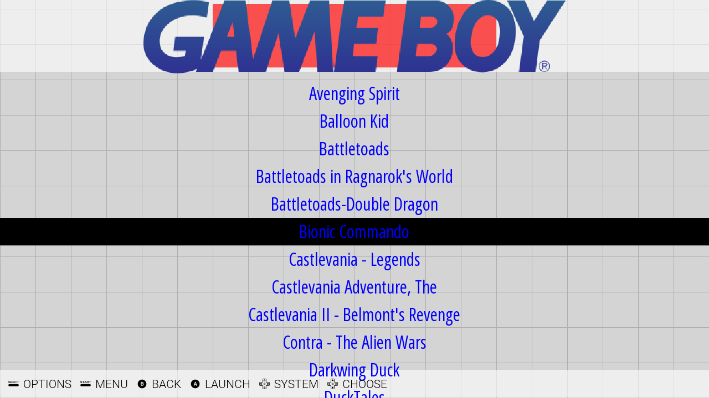
  <figcaption>Spare Theme Basic View - Logo Helper</figcaption>
</figure>

Now we can place the logo inside that box:
```xml
<image name="logo">
	<origin>0.5 0.5</origin>
	<pos>0.5 0.09</pos>
	<maxSize>0.4 0.16</maxSize>
</image>
```
Notice we are setting the `<origin>` and `<pos>` the same as "logo_helper". Instead of `<size>` we have used `<maxSize>`, but kept the numbers the same. If we used `<size>` the logo would stretch to fill the box, lose aspect ratio and look weird. Using `<maxSize>` forces the image to maintain aspect ratio. It will grow until either the sides or top/bottom hit the edge and then stop.

<figure markdown>
  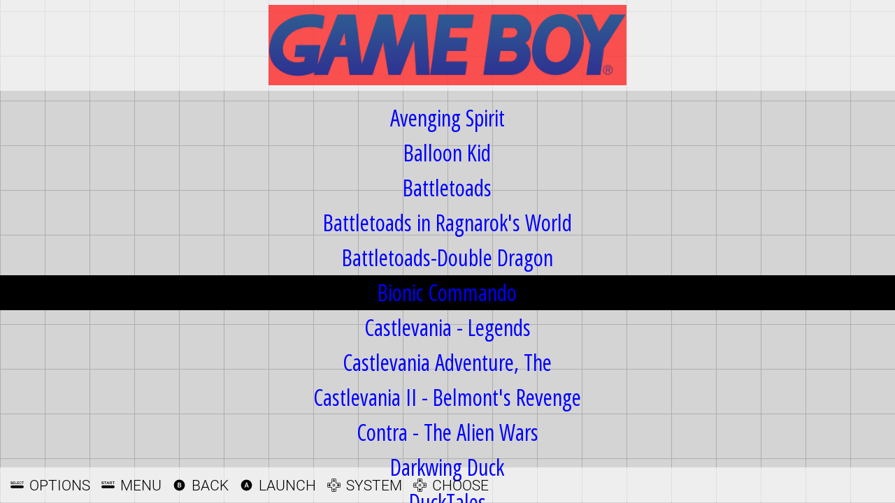
  <figcaption>Spare Theme Basic View - Logo</figcaption>
</figure>

We'll use another Helper Box to get the right spacing for the Gamelist:
```xml
<image name="gamelist_helper" extra="true">
	<path>./_inc/images/bg_color.png</path>
	<origin>0 0</origin>
	<pos>0.05 0.2</pos>
	<size>0.9 0.71</size>
	<color>ff0000aa</color>
</image>
```

<figure markdown>
  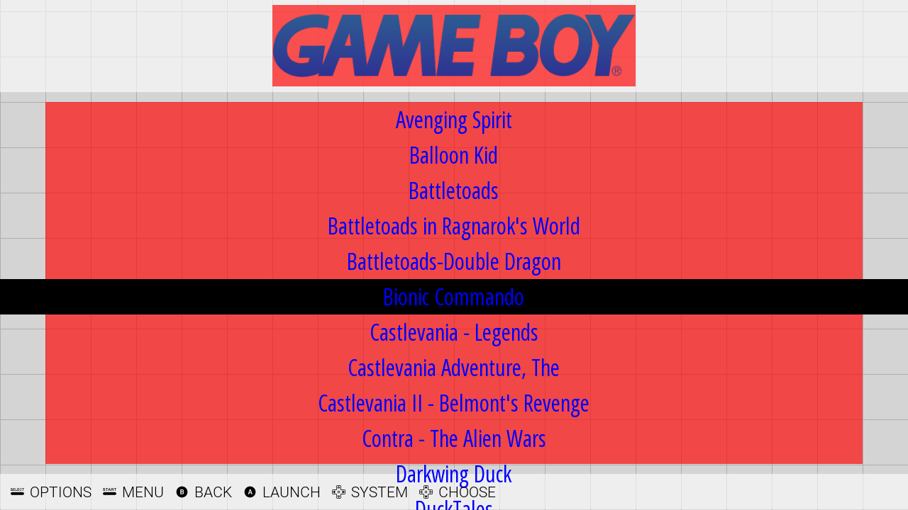
  <figcaption>Spare Theme Basic View - Gamelist Helper</figcaption>
</figure>

Now we know the size for the Gamelist:
```xml
<textlist name="gamelist">
	<selectorColor>000000</selectorColor>
	<selectedColor>FFFFFF</selectedColor>
	<primaryColor>000000</primaryColor>
	<secondaryColor>888888</secondaryColor>
	<fontPath>./_inc/fonts/Roboto-Light.ttf</fontPath>
	<pos>0.05 0.2</pos>
	<size>0.9 0.71</size>
	<fontSize>0.04</fontSize>
</textlist>
```
- `<selectorColor>` is the color of the bar that shows which game is selected. Set here to black.
- `<selectedColor>` is the color of the text of the selected game. Set here to white.
- `<primaryColor>` is the main text color of the Gamelist. Set here to black.
- `<secondaryColor>` is the color of any folders in your Gamelist. Set here to a mid-point gray.

<figure markdown>
  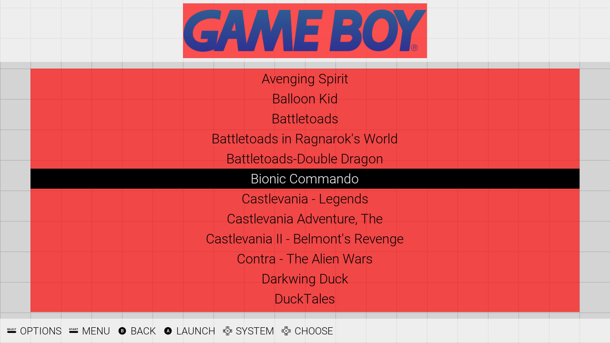
  <figcaption>Spare Theme Basic View - Gamelist</figcaption>
</figure>

All that is left is to remove the Helper Boxes.

Delete the `<image name="logo_helper" extra="true">` Element to remove the red box in the header.

Instead of deleting `<image name="gamelist_helper" extra="true">`, we can use it as the white background:

- Rename it from `gamelist_helper` to `background_gamelist`.
- Change `<color>ff0000aa</color>` to `<color>FFFFFF99</color>`.

You should now be the owner of a shiny new Basic View:

<figure markdown>
  
  <figcaption>Spare Theme Basic View - Complete</figcaption>
</figure>

### Detailed View

Now for the Big One; the _Detailed View_: This one isn't too bad mostly, but the metadata can be a real hassle to order, so it looks nice. Each part of the metadata has to be done individually... but we'll jump off that bridge when we come to it.

This is what we want to end up with:

<figure markdown>
  
  <figcaption>Spare Theme Detailed View - Complete</figcaption>
</figure>

However, it starts off looking like this:

<figure markdown>
  
  <figcaption>Spare Theme Detailed View - Background</figcaption>
</figure>

Remember we have already styled the Logo, the Background and the Help menu.

Open `spare.xml`.

We're going to start by placing a bunch of Helper boxes to block out where we want everything.

- You can use an image editing program to mock this up beforehand, and this is where the ES Theme Helper comes in very handy.
- Or you can just sort of freehand it. Add a box, check its shape, move it, resize it, check it again. Keep doing that until you are happy with it, and then add another box.

Add this code to `<view name="detailed"></view>`:

```xml
<image name="gamelist_helper" extra="true">
	<path>./_inc/images/bg_color.png</path>
	<origin>0 0</origin>
	<pos>0.01 0.02</pos>
	<size>0.35 0.89</size>
	<color>DC143C44</color>
</image>

<image name="image_helper" extra="true">
	<path>./_inc/images/bg_color.png</path>
	<origin>0 0</origin>
	<pos>0.37 0.02</pos>
	<size>0.35 0.62</size>
	<color>4169E144</color>
</image>

<image name="metadata_helper" extra="true">
	<path>./_inc/images/bg_color.png</path>
	<origin>0 0</origin>
	<pos>0.73 0.02</pos>
	<size>0.26 0.62</size>
	<color>00C5CD44</color>
</image>

<image name="desc_helper" extra="true">
	<path>./_inc/images/bg_color.png</path>
	<origin>0 0</origin>
	<pos>0.37 0.66</pos>
	<size>0.62 0.25</size>
	<color>EEC90044</color>
</image>
```
Which makes it look like this:

<figure markdown>
  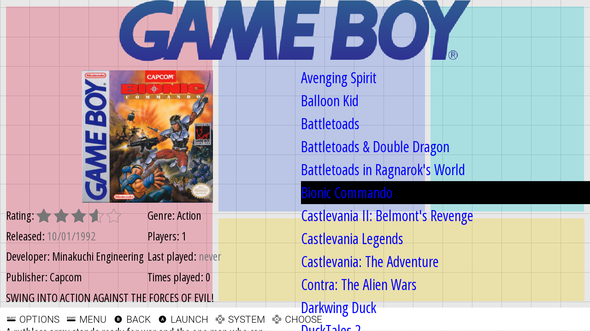
  <figcaption>Spare Theme Detailed View - Helpers</figcaption>
</figure>

These colored boxes will eventually be the semi-transparent white boxes that go behind the content, but for now we make them colored, so they are easier to see.

Now we want to add in some more Helper boxes within these, so the content will have some padding:

```xml
<image name="logo_helper" extra="true">
	<path>./_inc/images/bg_color.png</path>
	<origin>0.5 0.5</origin>
	<pos>0.186 0.14</pos>
	<size>0.33 0.19</size>
	<color>8B636C44</color>
</image>

<image name="gamelist_helper_2" extra="true">
	<path>./_inc/images/bg_color.png</path>
	<origin>0 0</origin>
	<pos>0.02 0.25</pos>
	<size>0.33 0.64</size>
	<color>8B636C44</color>
</image>

<image name="image_helper_2" extra="true">
	<path>./_inc/images/bg_color.png</path>
	<origin>0.5 0.5</origin>
	<pos>0.545 0.33</pos>
	<size>0.33 0.58</size>
	<color>0000EE44</color>
</image>

<image name="metadata_helper_2" extra="true">
	<path>./_inc/images/bg_color.png</path>
	<origin>0 0</origin>
	<pos>0.74 0.04</pos>
	<size>0.24 0.58</size>
	<color>00868B44</color>
</image>

<image name="desc_helper_2" extra="true">
	<path>./_inc/images/bg_color.png</path>
	<origin>0 0</origin>
	<pos>0.38 0.68</pos>
	<size>0.60 0.21</size>
	<color>CDAD0044</color>
</image>
```

<figure markdown>
  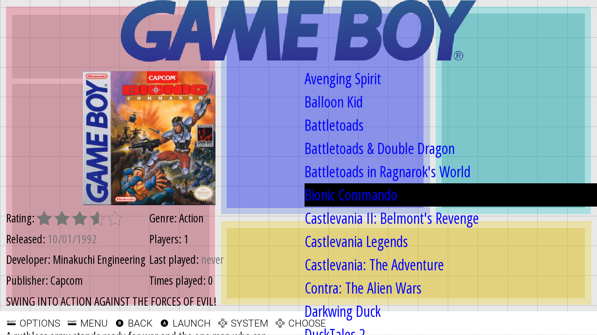
  <figcaption>Spare Theme Detailed View - Helpers Padding</figcaption>
</figure>

**Note**

> Notice `logo_helper` and `image_helper_2` both have `<origin>0.5 0.5</origin>`. This is because we want the images to be aligned from the very center of their Helper box. It takes a bit more work to get these aligned properly, but it looks better once they are.

Now it's just a matter of moving each piece of metadata into its correct place.

Move the Logo:
```xml
<image name="logo">
	<origin>0.5 0.5</origin>
	<pos>0.186 0.14</pos>
	<maxSize>0.33 0.19</maxSize>
</image>
```
<figure markdown>
  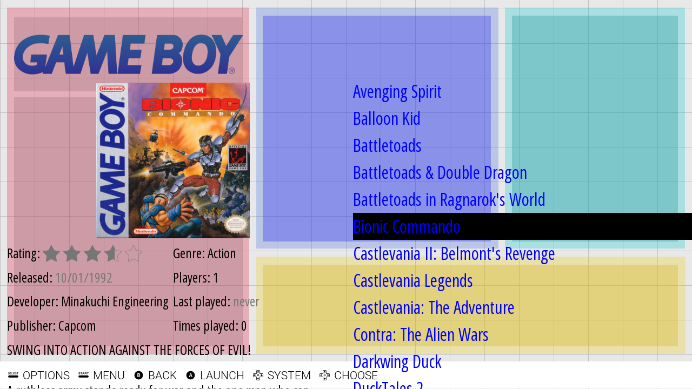
  <figcaption>Spare Theme Detailed View - Logo</figcaption>
</figure>

Now the Image:
```xml
<image name="md_image">
	<origin>0.5 0.5</origin>
	<pos>0.545 0.33</pos>
	<maxSize>0.33 0.58</maxSize>
</image>
```
<figure markdown>
  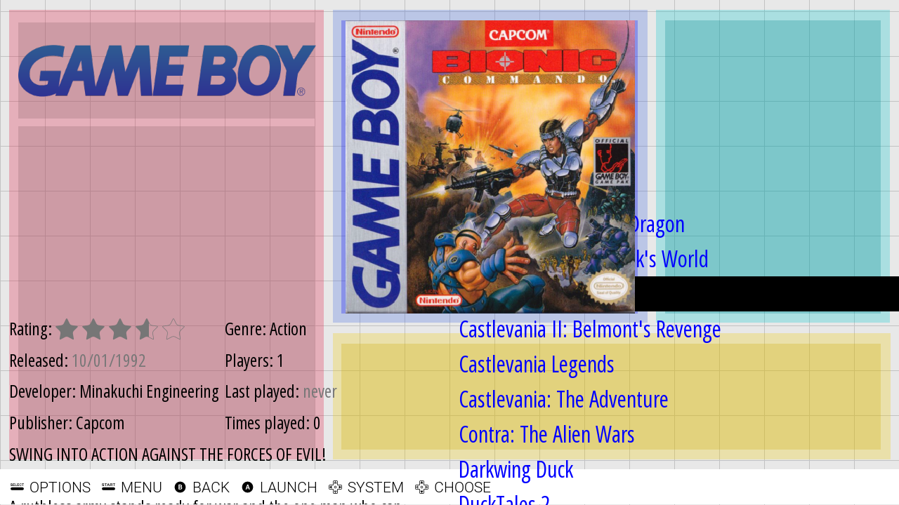
  <figcaption>Spare Theme Detailed View - Image</figcaption>
</figure>

The Gamelist:
```xml
<textlist name="gamelist">
	<selectorColor>000000</selectorColor>
	<selectedColor>FFFFFF</selectedColor>
	<primaryColor>000000</primaryColor>
	<secondaryColor>888888</secondaryColor>
	<fontPath>./_inc/fonts/Roboto-Light.ttf</fontPath>
	<pos>0.02 0.25</pos>
	<size>0.33 0.64</size>
	<fontSize>0.04</fontSize>
	<horizontalMargin>0.01</horizontalMargin>
</textlist>
```
<figure markdown>
  
  <figcaption>Spare Theme Detailed View - Gamelist</figcaption>
</figure>

The Description:
```xml
<text name="md_description">
	<pos>0.38 0.68</pos>
	<size>0.60 0.21</size>
	<color>000000</color>
	<fontPath>./_inc/fonts/Roboto-Light.ttf</fontPath>
	<fontSize>0.026</fontSize>
	<alignment>left</alignment>
	<forceUppercase>0</forceUppercase>
	<lineSpacing>1.6</lineSpacing>
</text>

```
<figure markdown>
  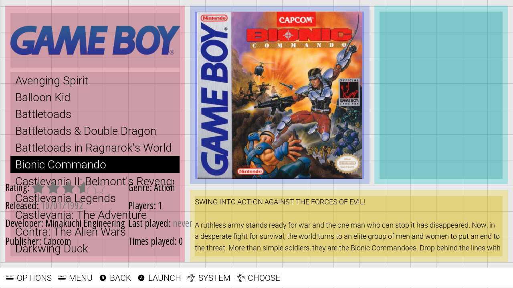
  <figcaption>Spare Theme Detailed View - Description</figcaption>
</figure>

Now... the fun part. The metadata. So far everything has been pretty simple. Logos, game lists, images, etc. are all big things that you can place without too much thought. Metadata is different.

Metadata is split up into eight main sections (without counting Image and Description in this list), and each of those sections has both a Label and a Value.

- `md_lbl_rating`, `md_rating`
- `md_lbl_releasedate`, `md_releasedate`
- `md_lbl_developer`, `md_developer`
- `md_lbl_publisher`, `md_publisher`
- `md_lbl_genre`, `md_genre`
- `md_lbl_players`, `md_players`
- `md_lbl_lastplayed`, `md_lastplayed`
- `md_lbl_playcount`, `md_playcount`

To make things more annoying, `md_releasedate` and `md_lastplayed` are both `<datetime>` fields instead of just plain `<text>` fields, so there are certain things they can't do, like be center aligned.

This is the XML excerpt to place the metadata as shown in this tutorial (long XML fragment):

```xml
<text name="md_lbl_rating, md_lbl_releasedate, md_lbl_developer, md_lbl_publisher, md_lbl_genre, md_lbl_players, md_lbl_lastplayed, md_lbl_playcount">
	<color>000000</color>
	<forceUppercase>1</forceUppercase>
	<fontPath>./_inc/fonts/Roboto-Medium.ttf</fontPath>
	<fontSize>0.02</fontSize>
	<size>0.24 0.01</size>
</text>

<text name="md_developer, md_publisher, md_genre, md_players, md_playcount">
	<color>000000</color>
	<forceUppercase>0</forceUppercase>
	<fontPath>./_inc/fonts/Roboto-Light.ttf</fontPath>
	<fontSize>0.024</fontSize>
	<size>0.23 0.02</size>
</text>
<datetime name="md_releasedate, md_lastplayed">
	<color>000000</color>
	<forceUppercase>0</forceUppercase>
	<fontPath>./_inc/fonts/Roboto-Light.ttf</fontPath>
	<fontSize>0.024</fontSize>
	<size>0.23 0.02</size>
</datetime>

<image name="metadata_helper_3" extra="true">
	<path>./_inc/images/bg_color.png</path>
	<origin>0 0</origin>
	<pos>0.74 0.04</pos>
	<size>0.24 0.02</size>
	<color>5bb80044</color>
</image>
<text name="md_lbl_rating">
	<pos>0.74 0.04</pos>
</text>

<image name="metadata_helper_4" extra="true">
	<path>./_inc/images/bg_color.png</path>
	<origin>0 0</origin>
	<pos>0.75 0.07</pos>
	<size>0.23 0.04</size>
	<color>5bb80044</color>
</image>
<rating name="md_rating">
	<pos>0.75 0.07</pos>
	<size>0.23 0.03</size>
	<filledPath>./_inc/images/star_full.png</filledPath>
	<unfilledPath>./_inc/images/star_hollow.png</unfilledPath>
</rating>

<image name="metadata_helper_5" extra="true">
	<path>./_inc/images/bg_color.png</path>
	<origin>0 0</origin>
	<pos>0.74 0.12</pos>
	<size>0.24 0.02</size>
	<color>5bb80044</color>
</image>
<text name="md_lbl_players">
	<pos>0.74 0.12</pos>
</text>

<image name="metadata_helper_6" extra="true">
	<path>./_inc/images/bg_color.png</path>
	<origin>0 0</origin>
	<pos>0.75 0.14</pos>
	<size>0.23 0.03</size>
	<color>5bb80044</color>
</image>
<text name="md_players">
	<pos>0.75 0.14</pos>
</text>

<image name="metadata_helper_7" extra="true">
	<path>./_inc/images/bg_color.png</path>
	<origin>0 0</origin>
	<pos>0.74 0.18</pos>
	<size>0.24 0.02</size>
	<color>5bb80044</color>
</image>
<text name="md_lbl_genre">
	<pos>0.74 0.18</pos>
</text>

<image name="metadata_helper_8" extra="true">
	<path>./_inc/images/bg_color.png</path>
	<origin>0 0</origin>
	<pos>0.75 0.20</pos>
	<size>0.23 0.03</size>
	<color>5bb80044</color>
</image>
<text name="md_genre">
	<pos>0.75 0.20</pos>
</text>

<image name="metadata_helper_9" extra="true">
	<path>./_inc/images/bg_color.png</path>
	<origin>0 0</origin>
	<pos>0.74 0.24</pos>
	<size>0.24 0.02</size>
	<color>5bb80044</color>
</image>
<text name="md_lbl_developer">
	<pos>0.74 0.24</pos>
</text>

<image name="metadata_helper_10" extra="true">
	<path>./_inc/images/bg_color.png</path>
	<origin>0 0</origin>
	<pos>0.75 0.26</pos>
	<size>0.23 0.03</size>
	<color>5bb80044</color>
</image>
<text name="md_developer">
	<pos>0.75 0.26</pos>
</text>

<image name="metadata_helper_11" extra="true">
	<path>./_inc/images/bg_color.png</path>
	<origin>0 0</origin>
	<pos>0.74 0.30</pos>
	<size>0.24 0.02</size>
	<color>5bb80044</color>
</image>
<text name="md_lbl_publisher">
	<pos>0.74 0.30</pos>
</text>

<image name="metadata_helper_12" extra="true">
	<path>./_inc/images/bg_color.png</path>
	<origin>0 0</origin>
	<pos>0.75 0.32</pos>
	<size>0.23 0.03</size>
	<color>5bb80044</color>
</image>
<text name="md_publisher">
	<pos>0.75 0.32</pos>
</text>

<image name="metadata_helper_13" extra="true">
	<path>./_inc/images/bg_color.png</path>
	<origin>0 0</origin>
	<pos>0.74 0.36</pos>
	<size>0.24 0.02</size>
	<color>5bb80044</color>
</image>
<text name="md_lbl_releasedate">
	<pos>0.74 0.36</pos>
</text>

<image name="metadata_helper_14" extra="true">
	<path>./_inc/images/bg_color.png</path>
	<origin>0 0</origin>
	<pos>0.75 0.38</pos>
	<size>0.23 0.03</size>
	<color>5bb80044</color>
</image>
<datetime name="md_releasedate">
	<pos>0.75 0.38</pos>
</datetime>

<image name="metadata_helper_15" extra="true">
	<path>./_inc/images/bg_color.png</path>
	<origin>0 0</origin>
	<pos>0.74 0.42</pos>
	<size>0.24 0.02</size>
	<color>5bb80044</color>
</image>
<text name="md_lbl_playcount">
	<pos>0.74 0.42</pos>
</text>

<image name="metadata_helper_16" extra="true">
	<path>./_inc/images/bg_color.png</path>
	<origin>0 0</origin>
	<pos>0.75 0.44</pos>
	<size>0.23 0.03</size>
	<color>5bb80044</color>
</image>
<text name="md_playcount">
	<pos>0.75 0.44</pos>
</text>

<image name="metadata_helper_17" extra="true">
	<path>./_inc/images/bg_color.png</path>
	<origin>0 0</origin>
	<pos>0.74 0.48</pos>
	<size>0.24 0.02</size>
	<color>5bb80044</color>
</image>
<text name="md_lbl_lastplayed">
	<pos>0.74 0.48</pos>
</text>

<image name="metadata_helper_18" extra="true">
	<path>./_inc/images/bg_color.png</path>
	<origin>0 0</origin>
	<pos>0.75 0.50</pos>
	<size>0.23 0.03</size>
	<color>5bb80044</color>
</image>
<datetime name="md_lastplayed">
	<pos>0.75 0.50</pos>
</datetime>
```

That comes out looking like this:

<figure markdown>
  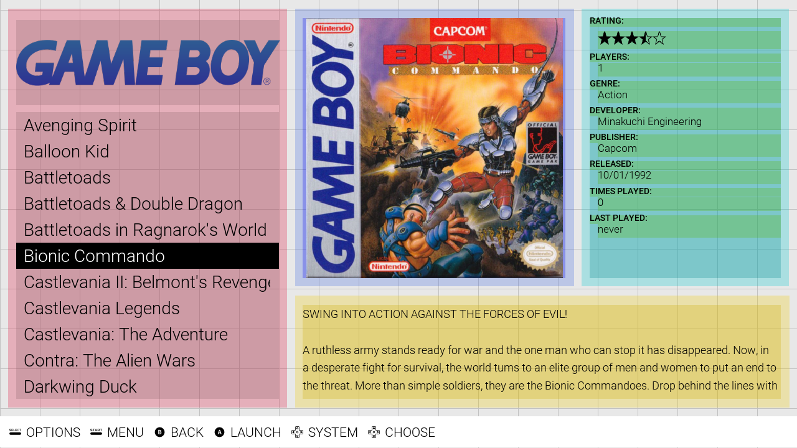
  <figcaption>Spare Theme Detailed View - Metadata Helpers</figcaption>
</figure>

Noticed how more Helper boxes are used for each piece of metadata? This was a long process of trail and error. Originally the font and spacing were too big, so they took up too much room. In the end they had to be shrunk down thus they don't take all the space.

Now just remove the second layer of padding Helpers, and change the main helper boxes color to `FFFFFF99`. The white helper boxes have the prefix to `background_` because they are now backgrounds rather than helpers.

### Video View

Now for the _Video View_.  Video support is a newer feature of EmulationStation, so we have to take care to ensure our theme is backward compatible.  Video view is an extension of the _Detailed View_ and should only require a few modifications.

The first step is to open `spare.xml`.  We will be moving `md_image` into a separate view definition.  Then we will add `video` to the original `detail` view element.  The result should look like the following.
```xml
<view name="detailed">
    <image name="md_image">
        <origin>0.5 0.5</origin>
        <pos>0.545 0.33</pos>
        <maxSize>0.33 0.58</maxSize>
    </image>
</view>

<view name="video"></view>

<view name="detailed, video">
<!-- everything else -->
</view>
```

Next we want to theme the new elements that video view adds.
```xml
<view name="detailed">
    <image name="md_image">
        <origin>0.5 0.5</origin>
        <pos>0.545 0.33</pos>
        <maxSize>0.33 0.58</maxSize>
    </image>
</view>

<view name="video">
    <video name="md_video">
        <origin>0.5 0.5</origin>
        <pos>0.545 0.39</pos>
        <maxSize>0.33 0.46</maxSize>
        <showSnapshotNoVideo>true</showSnapshotNoVideo>
    </video>
    <image name="md_marquee">
        <origin>0.5 0.5</origin>
        <pos>0.545 0.11</pos>
        <maxSize>0.33 0.15</maxSize>
    </image>
</view>

<view name="detailed, video">
<!-- everything else -->
</view>
```

The final step is to ensure backward compatibility with earlier versions of EmulationStation that do no support video.  To do this, we use a `feature` element.  The feature element is used to hide portions of the theme XML from versions that do not support the specified feature.

```xml
<view name="detailed">
    <image name="md_image">
        <origin>0.5 0.5</origin>
        <pos>0.545 0.33</pos>
        <maxSize>0.33 0.58</maxSize>
    </image>
</view>
<feature supported="video">
    <view name="video">
        <image name="md_video">
            <origin>0.5 0.5</origin>
            <pos>0.545 0.39</pos>
            <maxSize>0.33 0.46</maxSize>
        </image>
        <image name="md_marquee">
            <origin>0.5 0.5</origin>
            <pos>0.545 0.11</pos>
            <maxSize>0.33 0.15</maxSize>
        </image>
    </view>
</feature>

<view name="detailed, video">
<!-- everything else -->
</view>
```

You're all done. Congratulations!

<figure markdown>
  
  <figcaption>Spare Theme Detailed View - Complete</figcaption>
</figure>

This is the complete `spare.xml`:

```xml
<!--
theme name:		Spare
version:		1.0
author:			Matt Kennedy
email:
website:
license:		creative commons CC-BY-NC-SA
based on:		"Carbon" by Eric Hettervik
-->

<theme>

	<formatVersion>4</formatVersion>

	<view name="system, basic, detailed">

		<image name="background_color" extra="true">
			<path>./_inc/images/bg_color.png</path>
			<origin>0 0</origin>
			<pos>0 0</pos>
			<size>1 1</size>
			<color>d4d4d4</color>
		</image>

		<image name="background_pattern" extra="true">
			<path>./_inc/images/bg_pattern.png</path>
			<origin>0.5 0.5</origin>
			<pos>0.5 0.5</pos>
			<size>1 1</size>
			<color>aeaeae</color>
			<tile>true</tile>
		</image>

		<image name="background_help" extra="true">
			<path>./_inc/images/bg_color.png</path>
			<origin>0 1</origin>
			<pos>0 1</pos>
			<size>1 0.070</size>
			<color>FFFFFF99</color>
		</image>

		<helpsystem name="help">
			<textColor>000000</textColor>
			<iconColor>000000</iconColor>
			<fontPath>./_inc/fonts/Roboto-Light.ttf</fontPath>
			<fontSize>0.03</fontSize>
		</helpsystem>

	</view>

	<view name="basic">

		<image name="background_logo" extra="true">
			<path>./_inc/images/bg_color.png</path>
			<origin>0 0</origin>
			<pos>0 0</pos>
			<size>1 0.18</size>
			<color>FFFFFF99</color>
		</image>

			<image name="logo">
				<origin>0.5 0.5</origin>
				<pos>0.5 0.09</pos>
				<maxSize>0.4 0.16</maxSize>
			</image>

		<image name="background_gamelist" extra="true">
			<path>./_inc/images/bg_color.png</path>
			<origin>0 0</origin>
			<pos>0.05 0.2</pos>
			<size>0.9 0.71</size>
			<color>FFFFFF99</color>
		</image>

			<textlist name="gamelist">
				<selectorColor>000000</selectorColor>
				<selectedColor>FFFFFF</selectedColor>
				<primaryColor>000000</primaryColor>
				<secondaryColor>888888</secondaryColor>
				<fontPath>./_inc/fonts/Roboto-Light.ttf</fontPath>
				<pos>0.05 0.2</pos>
				<size>0.9 0.71</size>
				<fontSize>0.04</fontSize>
			</textlist>

	</view>

	<view name="detailed">

		<image name="background_logo_gamelist" extra="true">
			<path>./_inc/images/bg_color.png</path>
			<origin>0 0</origin>
			<pos>0.01 0.02</pos>
			<size>0.35 0.89</size>
			<color>FFFFFF99</color>
		</image>

			<image name="logo">
				<origin>0.5 0.5</origin>
				<pos>0.186 0.14</pos>
				<maxSize>0.33 0.19</maxSize>
			</image>

			<textlist name="gamelist">
				<selectorColor>000000</selectorColor>
				<selectedColor>FFFFFF</selectedColor>
				<primaryColor>000000</primaryColor>
				<secondaryColor>888888</secondaryColor>
				<fontPath>./_inc/fonts/Roboto-Light.ttf</fontPath>
				<pos>0.02 0.25</pos>
				<size>0.33 0.64</size>
				<fontSize>0.04</fontSize>
				<horizontalMargin>0.01</horizontalMargin>
			</textlist>

		<image name="background_image" extra="true">
			<path>./_inc/images/bg_color.png</path>
			<origin>0 0</origin>
			<pos>0.37 0.02</pos>
			<size>0.35 0.62</size>
			<color>FFFFFF99</color>
		</image>

			<image name="md_image">
				<origin>0.5 0.5</origin>
				<pos>0.545 0.33</pos>
				<maxSize>0.33 0.58</maxSize>
			</image>

		<image name="background_metadata" extra="true">
			<path>./_inc/images/bg_color.png</path>
			<origin>0 0</origin>
			<pos>0.73 0.02</pos>
			<size>0.26 0.62</size>
			<color>FFFFFF99</color>
		</image>

			<text name="md_lbl_rating, md_lbl_releasedate, md_lbl_developer, md_lbl_publisher, md_lbl_genre, md_lbl_players, md_lbl_lastplayed, md_lbl_playcount">
				<color>000000</color>
				<forceUppercase>1</forceUppercase>
				<fontPath>./_inc/fonts/Roboto-Medium.ttf</fontPath>
				<fontSize>0.02</fontSize>
				<size>0.24 0.01</size>
			</text>

			<text name="md_developer, md_publisher, md_genre, md_players, md_playcount">
				<color>000000</color>
				<forceUppercase>0</forceUppercase>
				<fontPath>./_inc/fonts/Roboto-Light.ttf</fontPath>
				<fontSize>0.024</fontSize>
				<size>0.23 0.02</size>
			</text>
			<datetime name="md_releasedate, md_lastplayed">
				<color>000000</color>
				<forceUppercase>0</forceUppercase>
				<fontPath>./_inc/fonts/Roboto-Light.ttf</fontPath>
				<fontSize>0.024</fontSize>
				<size>0.23 0.02</size>
			</datetime>

				<text name="md_lbl_rating">
					<pos>0.74 0.04</pos>
				</text>
				<rating name="md_rating">
					<pos>0.75 0.07</pos>
					<size>0.23 0.03</size>
					<filledPath>./_inc/images/star_full.png</filledPath>
					<unfilledPath>./_inc/images/star_hollow.png</unfilledPath>
				</rating>

				<text name="md_lbl_players">
					<pos>0.74 0.12</pos>
				</text>
				<text name="md_players">
					<pos>0.75 0.14</pos>
				</text>

				<text name="md_lbl_genre">
					<pos>0.74 0.18</pos>
				</text>
				<text name="md_genre">
					<pos>0.75 0.20</pos>
				</text>

				<text name="md_lbl_developer">
					<pos>0.74 0.24</pos>
				</text>
				<text name="md_developer">
					<pos>0.75 0.26</pos>
				</text>

				<text name="md_lbl_publisher">
					<pos>0.74 0.30</pos>
				</text>
				<text name="md_publisher">
					<pos>0.75 0.32</pos>
				</text>

				<text name="md_lbl_releasedate">
					<pos>0.74 0.36</pos>
				</text>
				<datetime name="md_releasedate">
					<pos>0.75 0.38</pos>
				</datetime>

				<text name="md_lbl_playcount">
					<pos>0.74 0.42</pos>
				</text>
				<text name="md_playcount">
					<pos>0.75 0.44</pos>
				</text>

				<text name="md_lbl_lastplayed">
					<pos>0.74 0.48</pos>
				</text>
				<datetime name="md_lastplayed">
					<pos>0.75 0.50</pos>
				</datetime>

		<image name="background_description" extra="true">
			<path>./_inc/images/bg_color.png</path>
			<origin>0 0</origin>
			<pos>0.37 0.66</pos>
			<size>0.62 0.25</size>
			<color>FFFFFF99</color>
		</image>

			<text name="md_description">
				<pos>0.38 0.68</pos>
				<size>0.60 0.21</size>
				<color>000000</color>
				<fontPath>./_inc/fonts/Roboto-Light.ttf</fontPath>
				<fontSize>0.026</fontSize>
				<alignment>left</alignment>
				<forceUppercase>0</forceUppercase>
				<lineSpacing>1.6</lineSpacing>
			</text>

	</view>

</theme>
```

The complete `theme.xml`, which is identical in each system folder:
```xml
<theme>

	<formatVersion>4</formatVersion>
	<include>./../spare.xml</include>

	<view name="system, basic, detailed">

		<image name="logo">
			<path>./system.svg</path>
		</image>

	</view>

</theme>
```

## Tips and Tricks

### Keyboard Shortcuts in EmulationStation

When you start EmulationStation with the debug flag on the command line, you have these keyboard combos available (to be used with _left_ ++ctrl++):

- ++ctrl+r++: Reload all UI views (system carousel and in-system view)
- ++ctrl+i++: Toggle visibility the image components (`<image ...>`) boundary boxes
- ++ctrl+t++: Toggle visibility the text component (`<text ...>`) boundary boxes
- ++ctrl+g++: Toggle visibility Gridlayout boundary boxes (if you develop a theme for grid layout)

### The Size Element for Text Components

The `<size/>` element takes a pair of values. However, depending on the values of the pair you may also control the layout of the text element. This section will illustrate the different values and their impact on the layout. 

As you may have already noticed the size element takes percent values of the actual screen size for _images_. For the layout of _text components_ with a given <size/>, additionally the selected font (its [Glyphs](https://en.wikipedia.org/wiki/Glyph)), the `<fontSize/>` and the defined `<lineSpacing/>` are factors for the layout. The last two values are also expected to be percent values. The glyph values are calculated by ES depending on the `<font/>` the theme has defined.

The pair of values is referenced as `width` (x-value) and `height` (y-value) e.g., `<size>width height</size>`.

The actual height of one line of text (`lineHeight`) is calculated by the `height` times the `lineSpacing` [times the largest height of the glyphs](https://github.com/RetroPie/EmulationStation/blob/9afa234f3c779ca23f832141f819886a984c1ee6/es-core/src/resources/Font.cpp#L476) times `fontSize`.

For your information: The images are taken from the [Epic Noir](https://github.com/c64-dev/es-theme-epicnoir) theme on a 5:4 display (1280x1024), cropped for this tutorial.

#### Case 1: Overly Large Size

<!-- case 1: x>0, y > one lineheight -->
<figure markdown>
  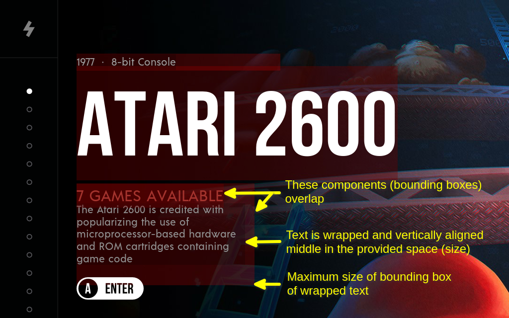
  <figcaption>Case 1: Text bounding box <code>height</code> greater than wrapped text height</figcaption>
</figure>

This shows the theme layout as-is when you check it out from GitHub. Notice how the "Games Available" bounding box (bbox) and the bbox of the text below overlap (the latter is named long description or `longdescription`). However, the texts do not overlap coincidentally as the bbox for the long description is large enough, and the text is put in the middle of the text bbox by default (instead of top or bottom vertical alignment).

This is the respective section in the theme file. Note line #8 and #21 (using same position) and #22 (size of long description):

```xml title="Part of es-theme-epicnoir/themes.xml" linenums="1" hl_lines="8 21 22"
    <text name="systemInfo"> <!-- style for "<n> GAMES AVAILABLE" -->
        <fontPath>./_art/Acre.otf</fontPath>
        <alignment>left</alignment>
        <backgroundColor>00000000</backgroundColor>
        <forceUppercase>1</forceUppercase>
        <color>A3332D</color>
        <origin>0 0</origin>
        <pos>0.12 0.3611</pos>
        <size>0 0.039</size>
        <fontSize>0.0315</fontSize>
    </text>

    <text name="longdescription" extra="true">
        <fontPath>./_art/Acre.otf</fontPath>
        <alignment>left</alignment>
        <forceUppercase>0</forceUppercase>
        <fontSize>0.021</fontSize>
        <color>8F8F8F</color>
        <lineSpacing>1.18</lineSpacing>
        <origin>0 0</origin>
        <pos>0.12 0.360</pos>
        <size>0.28 0.20</size>
    </text>
```

**Tip**

> All elements with fractions represent percentage values from 0.0 to 1.0. `<fontSize>` and `<lineSpacing>` may also use values greater than 1.0 (100%). You may use absolute pixel values for some elements, but you have to use the [`<resolution/>`](https://github.com/RetroPie/EmulationStation/blob/master/THEMES.md#the-resolution-tag) element for this.

**Takeaway #1**: If the size is large enough, more precisely the `width` is greater than zero and the `height` is greater than the sum of the `lineHeight`s used for the wrapped text it is wrapped and vertically aligned middle.

#### Case 2: Zero Width

<!-- case 2: x==0, y anything -->
<figure markdown>
  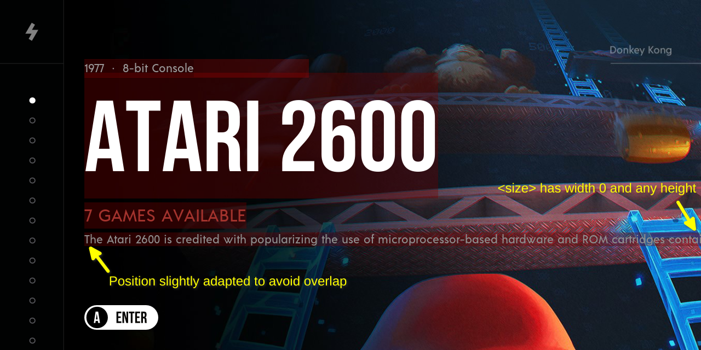
  <figcaption>Case 2: Text bounding box defines <code>width</code> equal to zero and any <code>height</code> value</figcaption>
</figure>

The `width` zero definition in XML (note line #10):

```xml linenums="1" hl_lines="10" 
    <text name="longdescription" extra="true">
        <fontPath>./_art/Acre.otf</fontPath>
        <alignment>left</alignment>
        <forceUppercase>0</forceUppercase>
        <fontSize>0.021</fontSize>
        <color>8F8F8F</color>
        <lineSpacing>1.18</lineSpacing>
        <origin>0 0</origin>
        <pos>0.12 0.415</pos>        
        <size>0 0.20</size>
    </text>
```

**Note**

> The `<pos/>` element (line #9) has been adapted from the original value to not clash with the bbox of "Games Available".

**Takeaway #2**: If the `width` of the size is zero, the text will be put on one line and not abbreviated. As the `height` is not interpreted in this case the bbox `height` is set to one `lineHeight` by ES, and the `height` value from the XML file is ignored. The text after the first newline character is cut off. It is not shown in the screenshot, but this cut-off is [implemented in ES](https://github.com/RetroPie/EmulationStation/blob/9afa234f3c779ca23f832141f819886a984c1ee6/es-core/src/components/TextComponent.cpp#L194).

#### Case 3: Zero Height

<!-- case 3: x>0, y==0 -->
<figure markdown>
  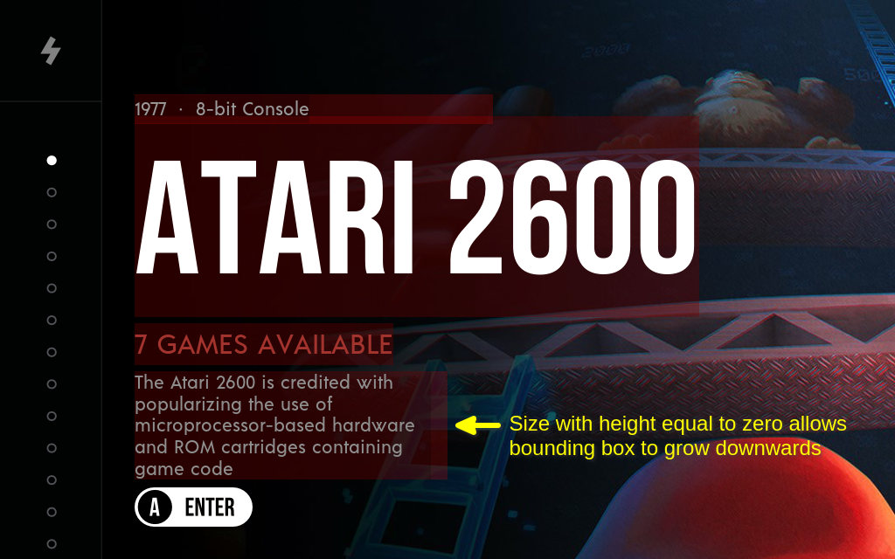
  <figcaption>Case 3: Text bounding box defines <code>width</code> greater zero and <code>height</code> equal to zero</figcaption>
</figure>

Example from the theme file:

```xml linenums="1" hl_lines="10"
    <text name="longdescription" extra="true">
        <fontPath>./_art/Acre.otf</fontPath>
        <alignment>left</alignment>
        <forceUppercase>0</forceUppercase>
        <fontSize>0.021</fontSize>
        <color>8F8F8F</color>
        <lineSpacing>1.18</lineSpacing>
        <origin>0 0</origin>
        <pos>0.12 0.415</pos>
        <size>0.28 0</size>
    </text>
```

**Takeaway #3**: If the `height` is zero the text is wrapped to not exceed the line width, the bbox grows downwards (if needed) while `pos` stays fixed. The actual line width is the product of the font's glyphs, `fontSize` and the display's x-resolution. 

**Tip: Preferred approach**

> This (`height` = 0) makes the intention of the theme layout clear to other users. If you want wrapped multiline text choose this approach.

#### Case 4: Force Abbreviation

<!-- case 4: x>0, y>0 but less than one lineheight -->
<figure markdown>
  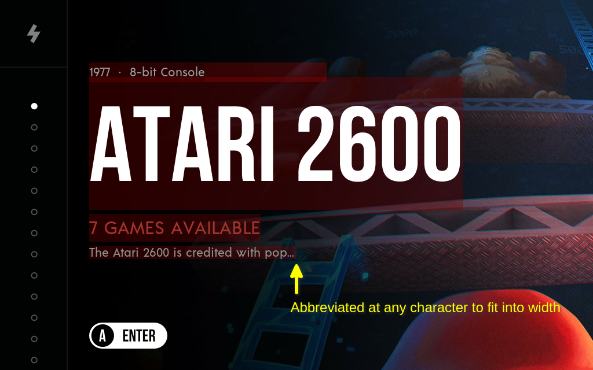
  <figcaption>Case 4: Text bounding box defines <code>width</code> greater zero, and <code>height</code> greater than zero and less than or equal to one <code>lineHeight</code></figcaption>
</figure>

This sample in the XML definition (note the small `height` value in line #10):

```xml linenums="1" hl_lines="10"
    <text name="longdescription" extra="true">
        <fontPath>./_art/Acre.otf</fontPath>
        <alignment>left</alignment>
        <forceUppercase>0</forceUppercase>
        <fontSize>0.021</fontSize>
        <color>8F8F8F</color>
        <lineSpacing>1.18</lineSpacing>
        <origin>0 0</origin>
        <pos>0.12 0.415</pos>
        <size>0.28 0.022</size>
    </text>
```

**Takeaway #4**: When the `height` _evaluates_ (remember how the line height is calculated) to be less than or equal to one `lineHeight` the text will be abbreviated with ellipsis to fit into the width of the bbox. Additionally, text after a newline character is cut off before abbreviated, if this shortened text fits into one line no ellipsis is added. It can not be shown in a screenshot, but this behavior is implemented in ES.

#### Case 5: Too Small Height

<!-- case5: x>0, y evals to more than one lineHeight but is less than all lineheights of the wrapped text-->
<figure markdown>
  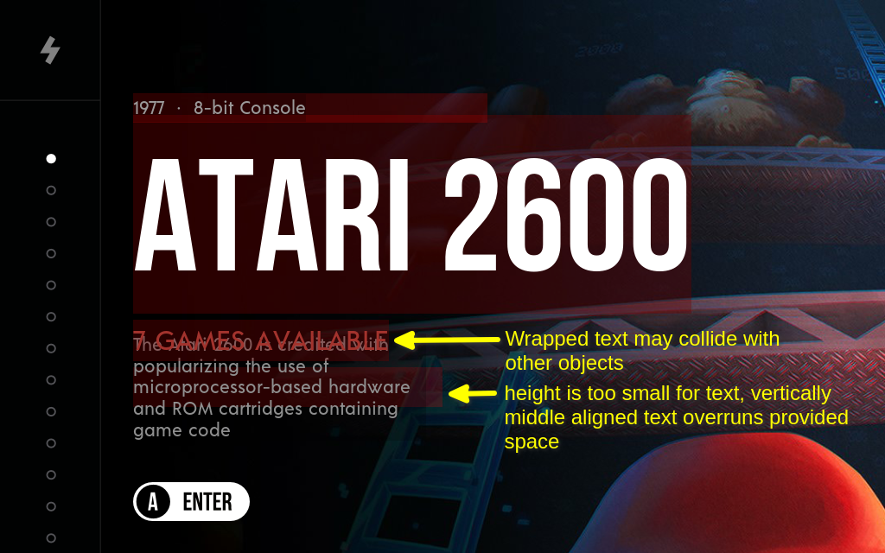
  <figcaption>Case 5: Text bounding box defines <code>width</code> greater zero, and <code>height</code> greater than one <code>lineHeight</code> but less than the sum of line heights of the wrapped text</figcaption>
</figure>

Representation in XML (the `height` value in line #10 represents a little more than one line height):

```xml linenums="1" hl_lines="10"
    <text name="longdescription" extra="true">
        <fontPath>./_art/Acre.otf</fontPath>
        <alignment>left</alignment>
        <forceUppercase>0</forceUppercase>
        <fontSize>0.021</fontSize>
        <color>8F8F8F</color>
        <lineSpacing>1.18</lineSpacing>
        <origin>0 0</origin>
        <pos>0.12 0.415</pos>
        <size>0.28 0.045</size>
    </text>
```

**Takeaway #5**: The result is the same as in case 1 or case 3, but is more difficult to grasp when maintaining the theme and may result in unwanted layouts, as the `size` _suggest_ the specific text for that element will fit into size when wrapped. Better use either `height` of zero or define a `height` with enough space for the longest text so that the bbox will not grow downwards on texts that exceed the height.

## Closing

Congratulations to those that made it this far. It's been a heck of a journey. You now have everything you need to make your own themes. Feel free after you have gained confidence with creating a theme to pay the RetroPie project forward by amending to this guide. For more sophisticated questions be invited to place your question in the [forum](https://retropie.org.uk/forum/category/9/projects-and-themes).

## References

- Themes Documentation by original ES author: [The ES Themes Reference Documentation](https://github.com/RetroPie/EmulationStation/blob/master/THEMES.md#the-resolution-tag)
- The Spare theme on GitHub: [es-theme-spare](https://github.com/mattrixk/es-theme-spare)
- Another theme from the original contributor of this tutorial: [MetaPixel](https://github.com/mattrixk/es-theme-metapixel)
- The full album of images used in this tutorial: [Imgur](https://imgur.com/a/LjRZk)
- Fake games Zip archive from this DropBox: [fake_games.zip](https://dl.dropboxusercontent.com/u/14838442/fake-games.zip)
- Portable EmulationStation by @herb_fargus: [EmulationStation Windows Portable (USB Stick)](https://www.youtube.com/watch?v=oHtCnBiyzOY), [Download the file](https://drive.google.com/file/d/0B2TMeZ6iEFvHYkNrMGVQSldkZ0U/view?usp=sharing)
- The ES Theme Helper by @Rookervik: [DropBox](https://dl.dropboxusercontent.com/u/60872572/EmulationStation/ES%20Theme%20Helper3.rar)
- RetroPie EmulationStation Themes Showcase: [ES Themes Showcase](Themes.md)
- A generic tutorial on how to convert a raster image to vector image:

<iframe width="560" height="315" src="https://www.youtube-nocookie.com/embed/q9Fk6OzX86U" title="Tutorial on creating Vector (SVG) logos from Bitmaps (e.g. PNG)" frameborder="0" allow="accelerometer; autoplay; clipboard-write; encrypted-media; gyroscope; picture-in-picture; allowfullscreen"></iframe>
