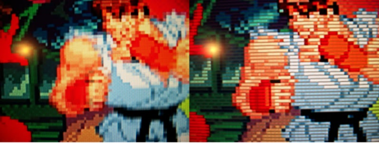
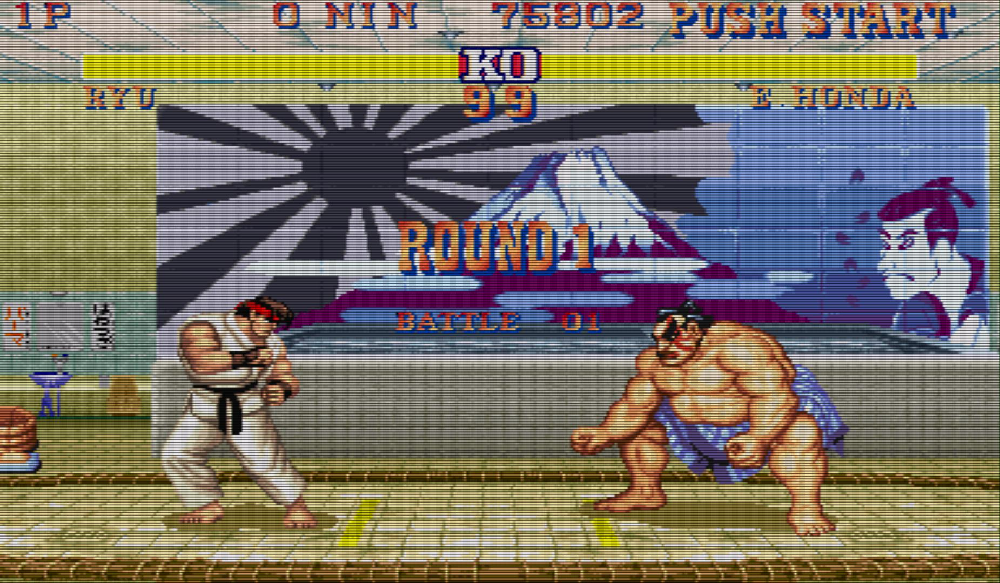
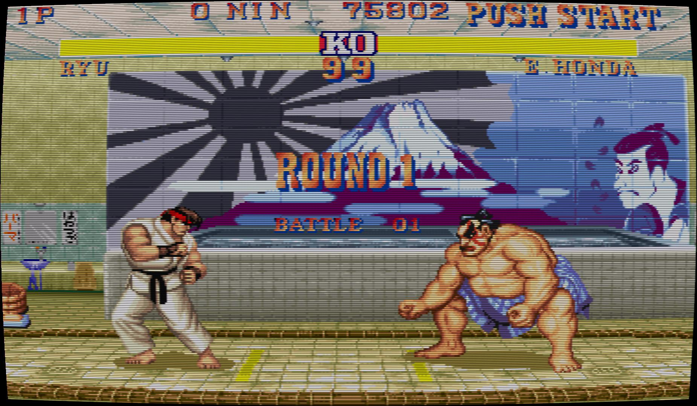
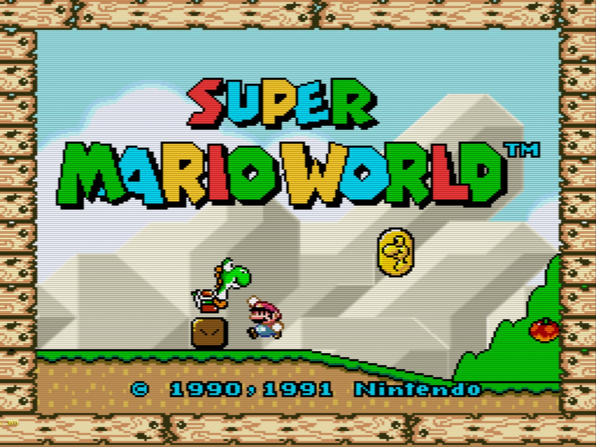
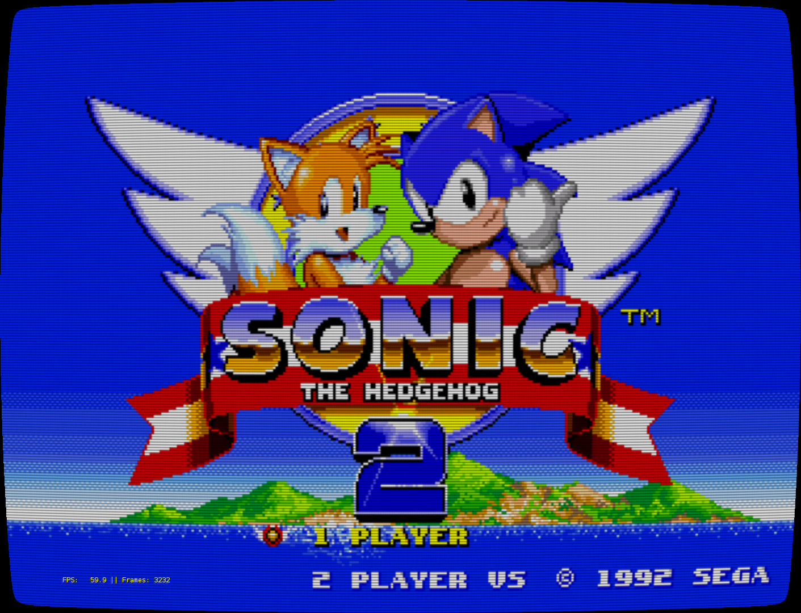
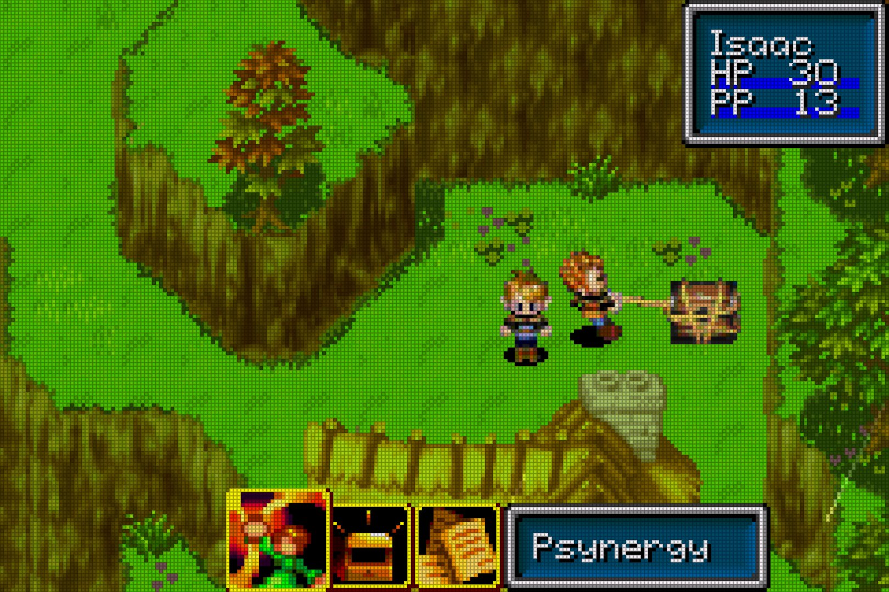
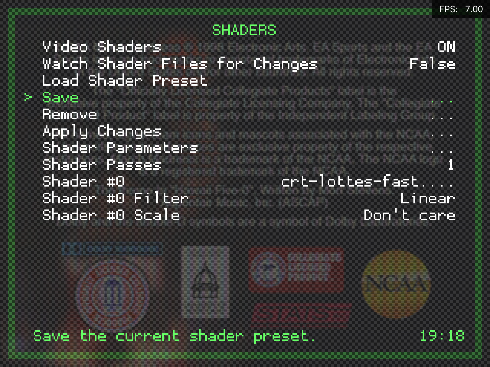
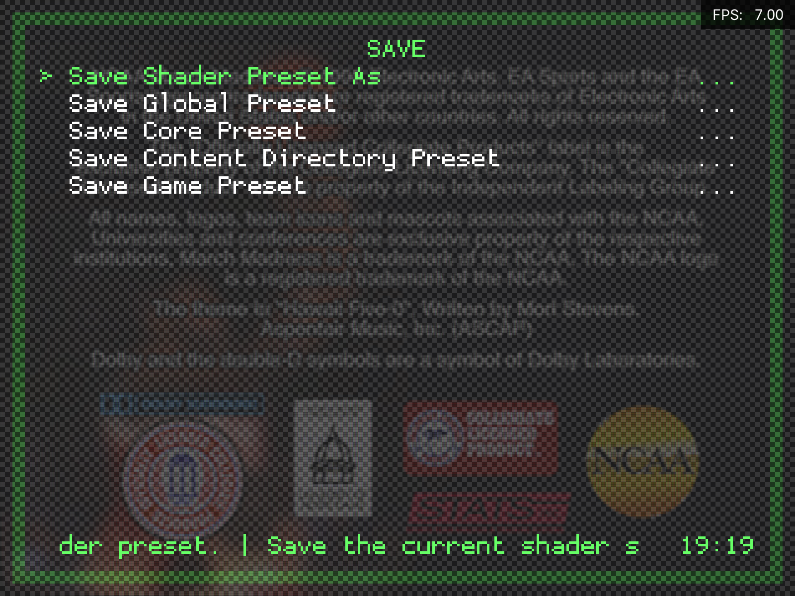
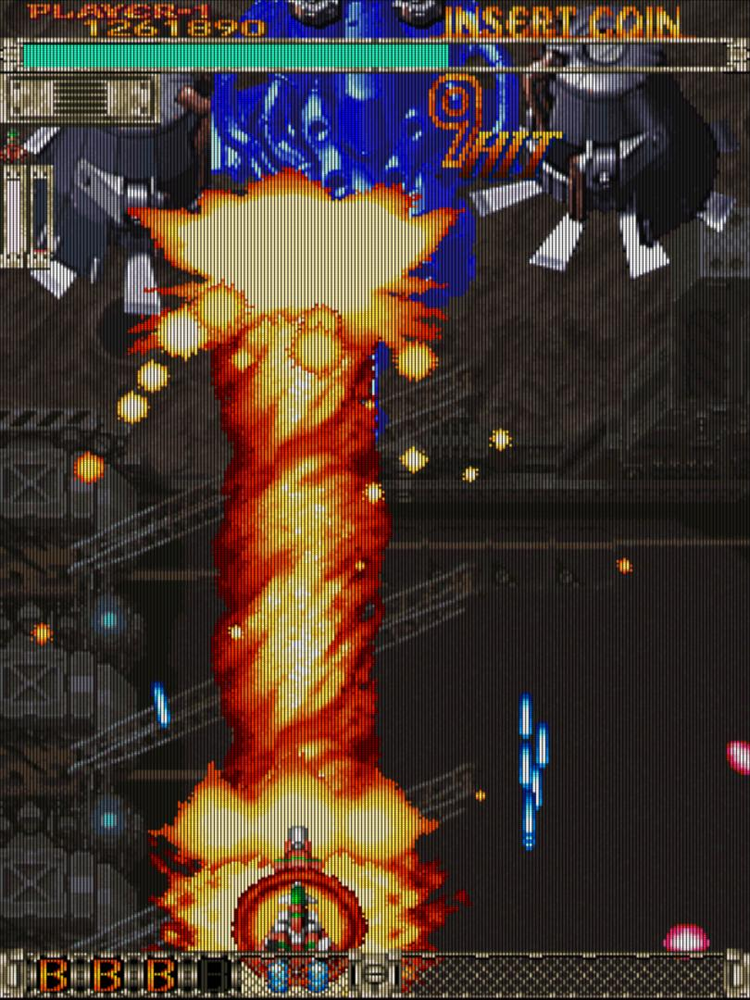
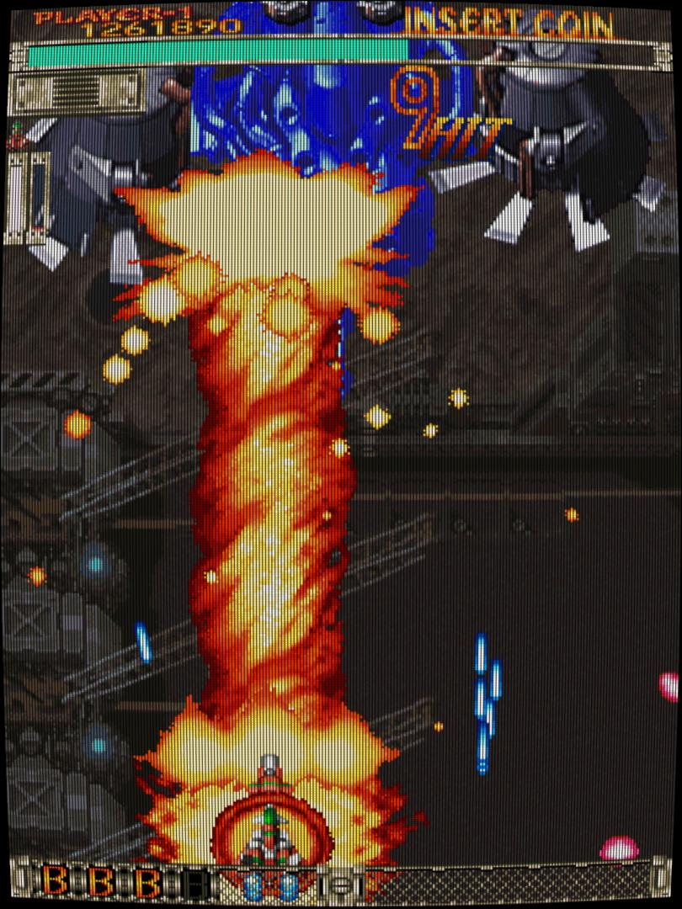

# Why are my games so pixelated?

By default RetroPie displays games far crisper than an original console and cabling ever could. For some, this can appear jagged and harsh compared to their memories of the smoother, less refined output of old CRT televisions. Further, old games themselves were designed and tested using the same televisions, so the raw image RetroPie outputs by default may not be the original artists' intention. Fortunately, there are ways of emulating CRTs.

## What did CRTs televisions do?

### Scan lines

See <https://en.wikipedia.org/wiki/Scan_line>. Broadly, this is the horizontal dark lines that appear when using a CRT, and also darkens the image slightly. As well as helping to look like a CRT, it also helps to make the pixels seem less jagged and helps provide definition:

See also: [shadow mask](https://en.wikipedia.org/wiki/Shadow_mask)

### Bloom

This describes the effect of lighter colours (particularly white) bleeding into their surrounding pixels, again helping to make things look less jagged:

### Signal distortion

The cabling used to connect consoles to CRTs was typically analogue and introduced noise to the image. This can have a pleasing effect by making the image smoother. Further, different broadcast regions had their own colour, resolutions, refresh and cabling standards, so a UK TV ('PAL' standard) would show the same game differently to a USA TV ('NTSC' standard).

### Curvature

Rather than today's flat screen displays, CRTs were not flat, and always featured some degree of curvature to the glass screen giving a 'fishbowl effect':

## RetroPie Alternatives

### Shaders

Shaders are small programs that a dedicated graphics chip (GPU) runs to alter the image. Unfortunately, the Raspberry Pi series feature fairly weak GPUs that struggle to run complex or multiple shaders. Fortunately, community members have built CRT shaders around these limitations:

#### crt-pi

[@davej](https://retropie.org.uk/forum/user/davej) has developed the **crt-pi** shader, that aims to maintain full speed at 1080p on even a Pi 1 (overclocked). It is highly configurable, but four presets are included in RetroPie:

1. `crt-pi.glslp`

2. `crt-pi-curvature.glslp`

The second two presets are `crt-pi-vertical.glslp` and `crt-pi-curvature-vertical.glslp`, described in [Vertical games](#vertical-games)

#### zfast

[@ghogan42](https://retropie.org.uk/forum/user/ghogan42) has developed the **zfast** shader, which seems to perform even better. Five presets are included in RetroPie:

1. `zfast_crt_standard.glslp`

2. `zfast_crt_curve.glslp`

3. `zfast_lcd_standard.glslp`

The final 2 presets are `zfast_crt_standard_vertical.glslp` and `zfast_crt_curve_vertical.glslp` for vertical games, as with [crt-pi](#crt-pi).

### Installation

**Note:** These shaders can only be used in Libretro emulators. Most default emulators in RetroPie are Libretro emulators, but you can confirm by looking for the `lr-` prefix in the emulator name via the [Runcommand](Runcommand).

You can select either preset via the [Configuration Editor](Configuration-Editor). Choose **Configure basic libretro emulator options**, then choose a specific emulator or **Configure default options for all libretro emulators** to make the change system-wide. Then, set `Video Shader Enable` to `true` and then set `Video Shader File` to the desired shader.

You can can save per-game or per-core, via opening the **RGUI** within a game with player 1's [Hotkey](Controller-Configuration#Hotkey) combination **Hotkey+X**, then **Quick Menu** > **Shaders**:

Presets are saved under the following folder:

`configs\all\retroarch\config\<CORE_NAME>\<GAME_NAME>.glslp`

### Scaling artfacts (particularly in Vertical games)

Some arcade games were run on a vertical CRT; a regular TV flipped over on its side. Whilst libretro shaders automatically rotate for this, the shadow mask effect does not, causing an unsightly 'rainbow' effect. Rather than add logic to the shader (making it slower), a special version for vertical games is available:

1. `crt-pi-vertical.glslp`

2. `crt-pi-curvature-vertical.glslp`

Both vertical and horizontal games can be improved further by using special override CFGs that increase the accuracy and alignment of the scanline effect. A set of these overrides is available for [lr-mame2003](lr-mame2003), [lr-fbneo](lr-fbneo) and [lr-nestopia](Nintendo-Entertainment-System#lr-nestopia) in [this forum topic](https://retropie.org.uk/forum/topic/4046/crt-pi-shader-users-reduce-scaling-artifacts-in-lr-mame2003-lr-fbalpha-horizontal-and-vertical-games).

### NTSC filters

WIP

### Video smoothing

Retroarch includes the facility to apply a basic bilinear smoothing filter across the screen. This filter reduces pixelation at essentially no performance cost, but gives a very soft image that may not be to everyone's taste. Here is example of it off and on:

This setting can be enabled in the [Configuration Editor](Configuration-Editor). Look for 'Video Smoothing'. It won't affect shaders, which control this setting independently.