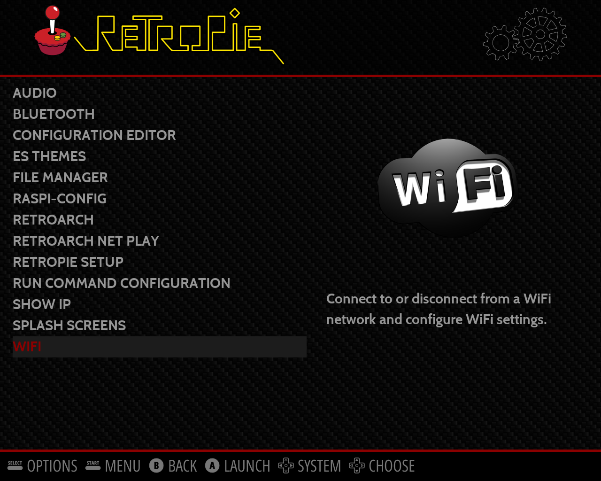
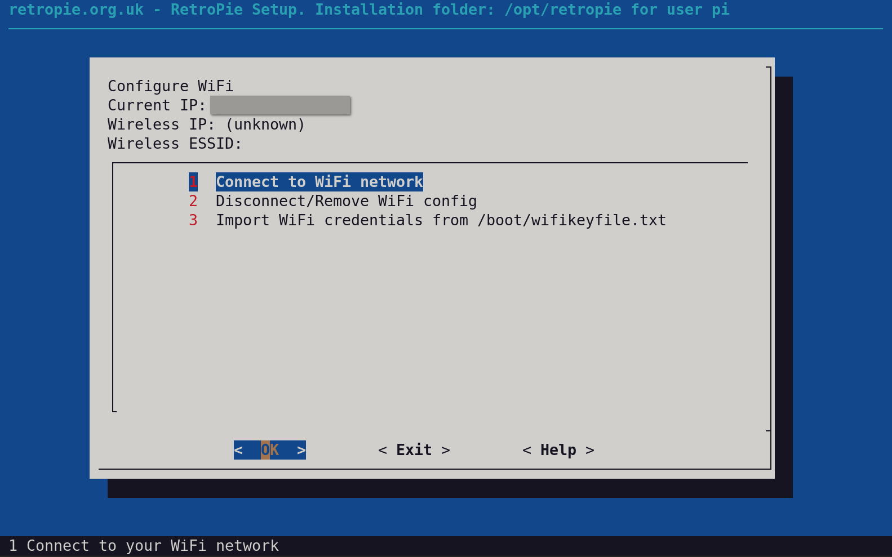
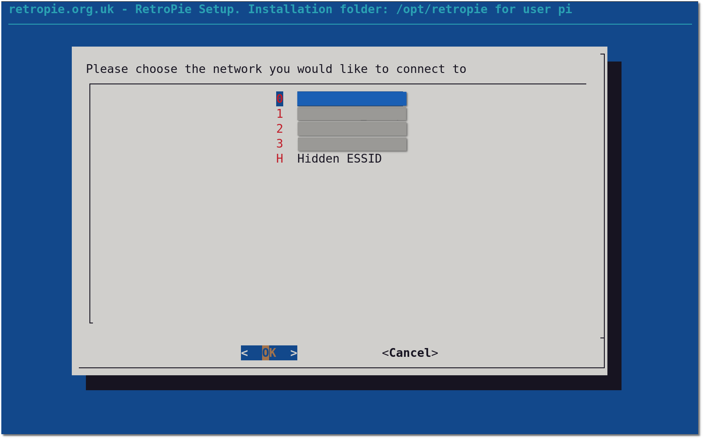
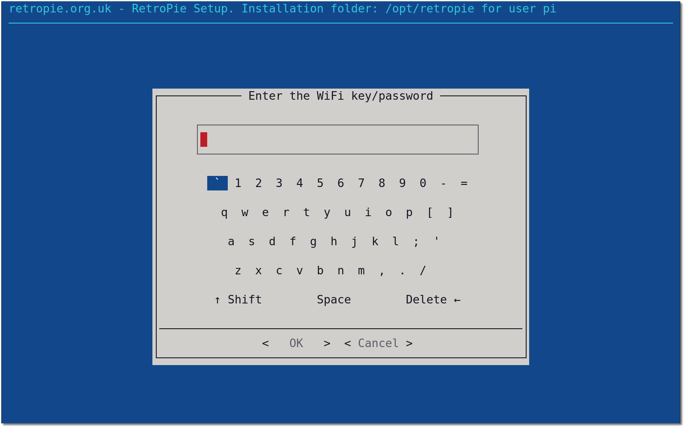
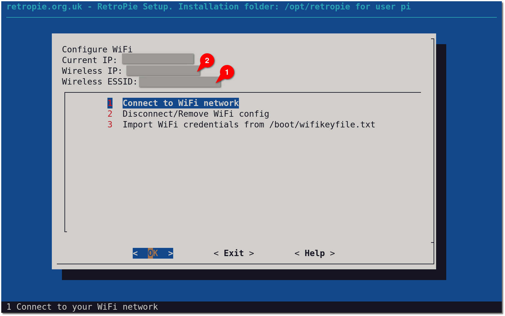
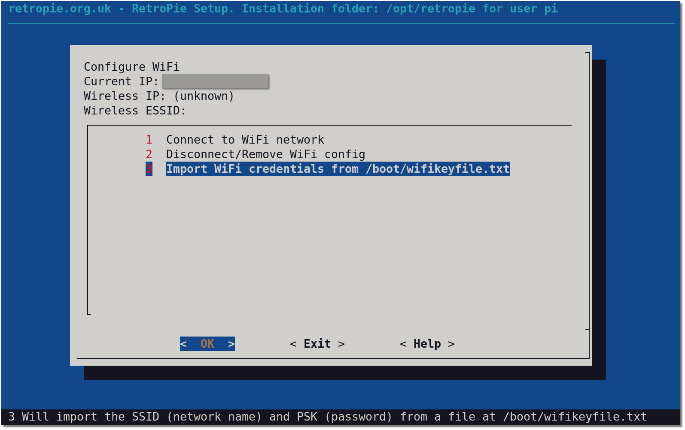

# Configuring WiFi

If you have a Raspberry Pi 3 or later model, WiFi is built into the Pi, if you have a Pi 2 or earlier model, then you will need a WiFi dongle. You can check to see if your WiFi dongle is compatible [here](http://elinux.org/RPi_USB_Wi-Fi_Adapters). You may want to use an USB WiFi dongle, then see [here](#using-an-external-dongle).

**Notes**:

- In order to use the WiFi on the Raspberry Pi, you will need to first configure the **WLAN Country** via `raspi-config`. It is under menu _5 Localisation options_ -> _L4 WLAN County_ in `raspi-config` dialogs. You can start `raspi-config` from the `RetroPie` menu in EmulationStation or from the command line with `sudo raspi-config`. This step is mandatory for all solution options described below.
- WiFi will not start up if you have an hard wired ethernet connection. After disconnecting the ethernet cable you will need to reboot to get WiFi started.

There are five main methods to configure WiFi:

1. [WiFi Module of RetroPie](#retropies-wifi-module): Easiest approach.
2. [Connecting to WiFi Without a Keyboard](#connecting-to-wifi-without-a-keyboard): Intermediate, uses a Raspberry Pi OS built-in feature.
3. [Manual Configuration (Interfaces)](#manual-configuration-interfaces): Advanced
4. [Manual Configuration (WPA_Supplicant)](#manual-configuration-wpa_supplicant): Advanced
5. [Connect via Wicd-Curses](#connecting-via-wireless-interface-connection-daemon-wicd): Advanced

## RetroPie's WiFi Module

You can access this from the Retropie menu from within EmulationStation (see below). Alternatively, you can access it from _Configuration / Tools_ -> _Configure WiFi_ in the RetroPie setup script from the command line.



It will open into this menu:



Choose your SSID from a list:



Either use a keyboard or use the on-screen-keyboard with one of your configured controllers to enter your wireless password. Be patient after you confirmed the dialog and let the configuration finish. Use your controller to navigate to the _OK_ button once you are done.



After it is done configuring you should see your wireless info in the original menu. At (1) you should see your wireless network name, at (2) you should see the IP address provided by the access point.



## Connecting to WiFi Without a Keyboard

Do this with the RetroPie SD card attached to a desktop PC. Create a file called `wpa_supplicant.conf` in the `/boot` folder (boot partition) using the following template. This will be moved automagically at next boot of the RetroPie to the `/etc/wpa_supplicant/` directory.

```
### Important: Change country=US to your country
country=US
ctrl_interface=DIR=/var/run/wpa_supplicant GROUP=netdev
update_config=1

# RETROPIE CONFIG START
network={
    ssid="your_real_wifi_ssid"
    psk="your_real_password"
}
# RETROPIE CONFIG END
```

Make sure to include the `# RETROPIE CONFIG START/END` lines as shown to ensure that the RetroPie-Setup WiFi configuration module will be able to cleanly edit/delete your configuration, if you wish to change it later.

## Connecting to WiFi Without a Keyboard (Alternative)

**Note**: Starting with Raspberry Pi OS Stretch, loading the wifikey file from the setup script is no longer necessary: You should prefer the option above.

If you wish to connect to WiFi without needing an extra keyboard you can add a file to the boot partition of the sd card called `wifikeyfile.txt`

place your network details here (note only works on WPA networks)
```
ssid="NETWORK_NAME"
psk="NETWORK_PASSWORD"
```

You can then access the WiFi module and select the option to _Import WiFi credentials from /boot/wifikeyfile.txt_



## Manual Configuration (Interfaces)

`sudo nano /etc/network/interfaces`

### WPA/WPA2

```shell
auto lo

iface lo inet loopback
iface eth0 inet dhcp

allow-hotplug wlan0
auto wlan0
iface wlan0 inet dhcp
   wpa-ssid "NETWORK_NAME"
   wpa-psk "NETWORK_PASSWORD"
```
you can also add `wireless-power off` at the end if you have issues with your WiFi dongle turning off and on a lot and not being able to maintain a connection.

### Open Network

```shell
auto lo

iface lo inet loopback
iface eth0 inet dhcp

allow-hotplug wlan0
auto wlan0
iface wlan0 inet dhcp
  wireless-essid NETWORK_NAME
  wireless-mode managed
```

**Note**: Make sure you understand the security implications when setting up and using an open wireless network.

### Hidden SSID

```
auto lo

iface lo inet loopback
iface eth0 inet dhcp

allow-hotplug wlan0
auto wlan0
iface wlan0 inet dhcp
   wpa-ssid "NETWORK_NAME"
   wpa-psk "NETWORK_PASSWORD"
   wpa-scan-ssid 1
```

### Static IP

The following only applies to Raspbian Jessie

You can use the default `/etc/network/interfaces`
```shell
# interfaces(5) file used by ifup(8) and ifdown(8)

# Please note that this file is written to be used with dhcpcd
# For static IP, consult /etc/dhcpcd.conf and 'man dhcpcd.conf'

# Include files from /etc/network/interfaces.d:
source-directory /etc/network/interfaces.d

auto lo
iface lo inet loopback

iface eth0 inet manual

allow-hotplug wlan0
iface wlan0 inet manual
    wpa-conf /etc/wpa_supplicant/wpa_supplicant.conf

allow-hotplug wlan1
iface wlan1 inet manual
    wpa-conf /etc/wpa_supplicant/wpa_supplicant.conf
```
Then you will need to edit `/etc/dhcpcd.conf` and add at the top modifying it for your own router and IP address:

```
interface wlan0
 static ip_address=192.168.0.120/24
 static routers=192.168.0.1
 static domain_name_servers=8.8.8.8
```
If you want a static IP with ethernet then change it to:
```
interface eth0
 static ip_address=192.168.0.120/24
 static routers=192.168.0.1
 static domain_name_servers=8.8.8.8
```

`sudo reboot` for changes to take effect.

After reboot (if configured correctly) your WiFi will be working.

## Manual Configuration (WPA_Supplicant)

**Taken from the Raspberry Pi Foundation [here](https://www.raspberrypi.org/documentation/computers/configuration.html#wireless-networking-command-line):**

> This method is suitable if you do not have access to the graphical user interface normally used to set up WiFi on the Raspberry Pi. It is especially suited for use with a serial console cable if you do not have access to a screen or wired Ethernet network. Also note that no additional software is required; everything you need is already included on the Raspberry Pi.

### Getting Network Details

To scan for WiFi networks, use the command `sudo iwlist wlan0` scan. This will list all available WiFi networks along with other useful information. Look out for:

1. `ESSID:"testing"`. This is the name of the WiFi network.

2. `IE: IEEE 802.11i/WPA2 Version 1`. This is the authentication used; in this case it is WPA2, the newer and more secure wireless standard which replaces WPA1. This guide should work for WPA or WPA2, but may not work for WPA2 enterprise mode.
You will also need the password for the WiFi network. For most home routers this is located on a sticker on the back of the router. The ESSID (`ssid`) for the network in this example is `testing` and the password (`psk`) `testingPassword`.

### Adding Network Details to Raspberry Pi

First you will need to amend `/etc/network/interfaces` to point to wpa-supplicant configuration if it is not already:

```
auto lo

iface lo inet loopback
iface eth0 inet dhcp

allow-hotplug wlan0
auto wlan0
iface wlan0 inet manual
wpa-roam /etc/wpa_supplicant/wpa_supplicant.conf
# The following line specified in /etc/network/interfaces will activate and
# configure each 'default' network in wpa_supplicant.conf with DHCP upon a
# successful connection to an access point.
# (this line needs to be here for wpa-roam)
iface default inet dhcp
```
We have changed it to wpa-roam so that it will reconnect if the connection drops.

Open the `wpa-supplicant.conf` configuration file with the editor `nano`:

`sudo nano /etc/wpa_supplicant/wpa_supplicant.conf`

Go to the bottom of the file and add the following:
```shell
network={
    ssid="The_ESSID_from_earlier"
    psk="Your_wifi_password"
}
```

The following are different ways of configuring your network depending on what encryption your router is configured to.

#### WPA/WPA2

```shell
network={
    ssid="NETWORK_NAME"
    psk="NETWORK_PASSWORD"
}
```

#### Open Network

```shell
network={
    ssid="NETWORK_NAME"
    key_mgmt=NONE
}
```

**Note**: Make sure you understand the security implications when setting up and using an open wireless network.

#### Hidden SSID

```shell
network={
    ssid="NETWORK_NAME"
    # it can be any encryption type,
    # just make sure to add the "scan_ssid=1" line after your settings.
    key_mgmt=NONE
    scan_ssid=1
}
```
Now save the file by pressing <kbd>ctrl</kbd>+<kbd>x</kbd> then <kbd>y</kbd>, then finally press <kbd>enter</kbd>.

At this point,` wpa-supplicant` will normally notice a change has occurred within a few seconds, and it will try and connect to the network. If it does not, either manually restart the interface with `sudo ifdown wlan0` and `sudo ifup wlan0`, or reboot your Raspberry Pi with `sudo reboot`.

You can verify if it has successfully connected using `ifconfig wlan0`. If the `inet addr` field has an address beside it, the Pi has connected to the network. If not, check your password and ESSID are correct.

## Connecting Via Wireless Interface Connection Daemon (Wicd)

Note that this may cause a small amount of background cpu usage, which can stop the CPU from scaling to lowest frequency.

Make sure you have internet connectivity on the Raspberry via ethernet. Install Wicd with `sudo apt install wicd wicd-curses` and then type `wicd-curses` in the terminal to open it.


Navigate to your wireless network and Press <kbd>-></kbd> (cursor right) to configure your WiFi.


Do enable _Automatically connect to this network_ (by pressing <kbd>enter</kbd>) and type in your WiFi password in the field labeled _key_ press <kbd>F10</kbd> to save and then press <kbd>shift</kbd>+<kbd>c</kbd> to connect and finally press <kbd>shift</kbd>+<kbd>q</kbd> to exit back to the terminal.

There are some noted issues with the daemon using some CPU and preventing the Pi from scaling to lowest frequency. If that is the case you can back out from wicd-curses by typing `sudo apt remove wicd-curses` and proceed to setup your WiFi using other methods noted above.

# Using an External Dongle

You may want to use an external USB WiFi adapter (dongle) for several reasons: One may be that your Pi case is attenuating or even blocking the wireless signal (with a metal case it is pretty common), for instance.

First configure WiFi with the internal controller, using one of the above methods. Then:
Plug-in the USB WiFi dongle, reboot. After reboot verify it is connected using `ifconfig`: It should be listed as `wlan1` and have an IP address assigned. Then, disable the onboard WiFi by editing `/boot/config.txt` and adding the line `dtoverlay=disable-wifi`. Reboot and verify connectivity via the USB WiFi adapter.
