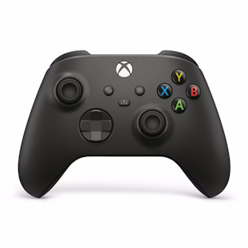
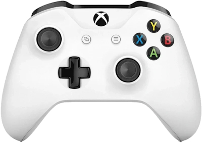
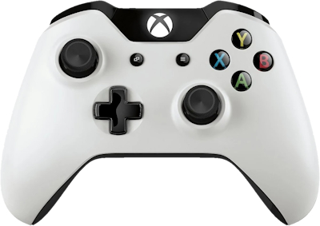
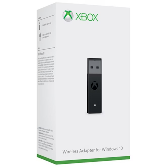

# Xbox Wireless Controller

There are a few ways to use these controllers with the Raspberry Pi:

* **Bluetooth**

    Most Xbox Wireless Controllers can connect to the Raspberry Pi via built-in Bluetooth or a USB Bluetooth adapter, excluding some older models.

* **Xbox Wireless Adapter for Windows**

    *Try Bluetooth first as this solution requires installing external software*

    All official Xbox Wireless Controllers can pair with this official Microsoft USB Wireless Adapter. This product has changed slightly over the years (including a size reduction) and can go by several names, but they are all very similar and function the same.

* **USB Cable**

    The simplest way is to plug in with a USB cable, which should either be Micro USB or USB C depending on the age of your controller.

See [Connection Methods](#connection-methods) for details.

## General Controller Usage

### Pairing Mode

To put the controller into pairing mode, press and hold the small pairing button on the top right of the controller.    
After a few seconds, the Xbox/Home button will strobe rapidly.    
The controller is now in pairing mode.

### To turn the controller off

The controller will automatically turn off if left idle for about 15 minutes.    
To force the controller to turn off sooner, hold the Xbox/Home button for 7 seconds.    
Once the Xbox/Home button light turns off, the controller is off.    
Shutting down your Pi will also turn the controller off.

### To turn the controller on

Briefly hold the Xbox/Home button.    
The Xbox/Home will light up.    
The controller will automatically re-connect to anything it's already been paired to.

## Connection Methods

### Bluetooth

Most modern Xbox controllers feature Bluetooth connectivity; however, older ones may not.

- If you are using a controller with a Share button ("Series"), or any "Elite" controller, Bluetooth support is guaranteed
- If you are using an Xbox One controller, it may or may not have Bluetooth depending on the specific model. The easiest way to tell is if your controller's face plate is a single piece, including around the Xbox/Home button area, as the models with a separate piece towards the top (see the following images) cannot connect via Bluetooth. You can also check if your model is 1708 or newer by checking the sticker in the battery compartment.

*Can connect via Bluetooth*

*Cannot connect via Bluetooth*

For best results, update the firmware of your controller using an [Xbox console or Windows PC](https://support.xbox.com/en-US/help/hardware-network/controller/update-xbox-wireless-controller).

Bluetooth connectivity for modern Xbox controllers is provided by the `xpadneo` driver, which must be installed by the user:

1. Enter the RetroPie Setup Script
2. Manage Packages
3. Manage Driver Packages
4. xpadneo
5. Install from source

After installation you should be able to add the controller to RetroPie using the [standard pairing tool](Bluetooth-Controller#adding-a-bluetooth-controller-to-retropie).

/// note | Note
If you tried to pair the controller before installing this packages, you should remove any left over entries from the Bluetooth pairing tool before trying to connect again.
///

### Xbox Wireless Adapter for Windows

/// note | Note
This connection method requires manual installation of external software.
It is recommended to simply use Bluetooth for wireless connections instead if it works for you without issue.
///

Using this adapter on the Pi requires the use of the `xone` driver.

Currently there is no official RetroPie package for this driver which means it must be installed manually by following the [xone installation instructions](https://github.com/dlundqvist/xone?tab=readme-ov-file#installation).

Additionally, once this driver is loaded, it will take precedence over the `xpad` driver, which will prevent the usage of Xbox 360 controllers since it does not support those. To remedy this, you will have to install [xpad-noone](https://github.com/forkymcforkface/xpad-noone?tab=readme-ov-file#installing).

Once the system is prepared, simply connect the USB adapter to the Pi and hold down it's button to put it into pairing mode, followed by the same for the controller, which should then pair to the adapter.

### USB Cable

USB connectivity for modern Xbox controllers is provided by the `xpad` driver which is installed by default. Simply plug the controller in via a USB Micro-B/USB-C cable (depending on the port your controller has) and it should work out of the box